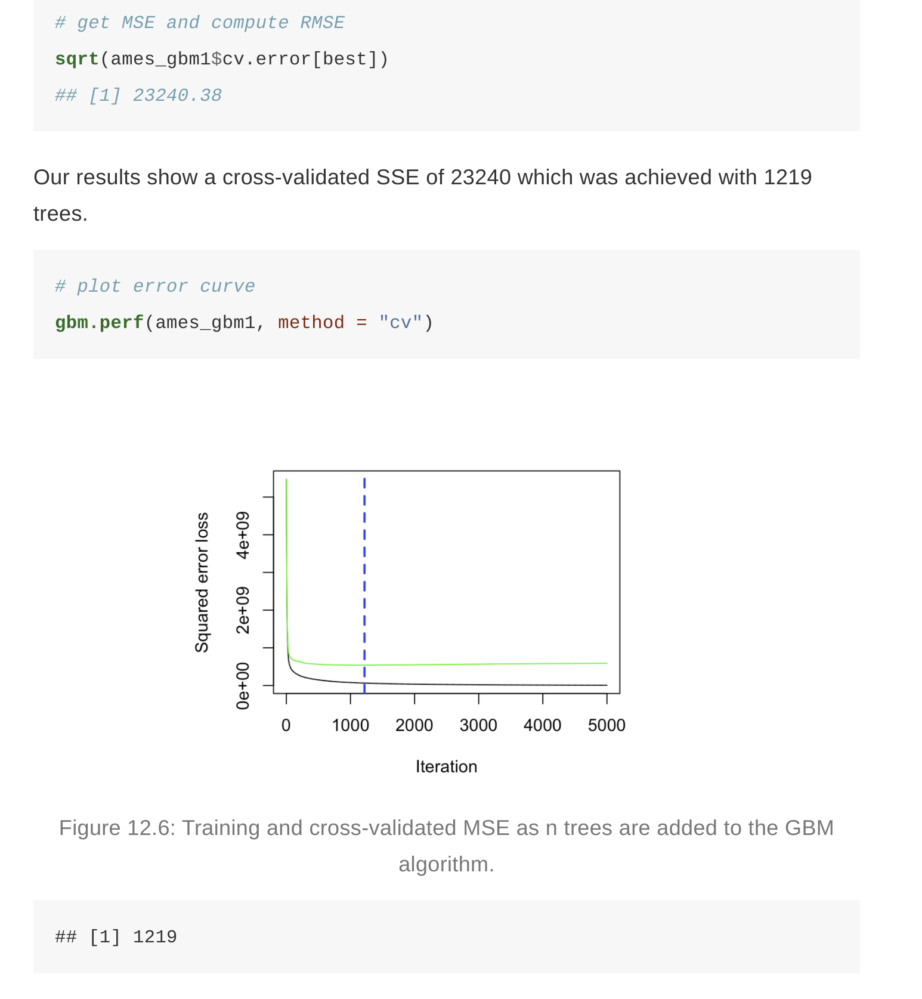

```{r setup}
# Set global R options
options(scipen = 999)

# Set the graphical theme
ggplot2::theme_set(ggplot2::theme_light())

# Set global knitr chunk options
knitr::opts_chunk$set(
  cache = FALSE,
  warning = FALSE, 
  message = FALSE
)

# Load required packages
library(tidyr)
library(rpart)
library(ggplot2)
library(dplyr)
```

## Introduction

A nice quote from *Hands-on Machine Learning with R*:

>Bagging and random forests, on the other hand, work by combining multiple models together into an overall ensemble. New predictions are made by combining the predictions from the individual base models that make up the ensemble (e.g., by averaging in regression). Since averaging reduces variance, bagging (and hence, random forests) are most effectively applied to models with low bias and high variance (e.g., an overgrown decision tree). While boosting is a general algorithm for building an ensemble out of simpler models (typically decision trees), it is more effectively applied to models with high bias and low variance! Although boosting, like bagging, can be applied to any type of model, it is often most effectively applied to decision trees (which we’ll assume from this point on).

The process can be illustrated as a **sequential ensemble**:

```{r sequential-fig, echo=TRUE, fig.align='center', fig.cap="Sequential ensemble approach.", out.height="75%", out.width="75%"}

knitr::include_graphics("boosted-trees-process.png")
```

## The algorithm

Boosting is a greedy algorithm to learn additive basis function models of the form
$$f(x) = \alpha_{0} + \sum_{m=1}^{M}\alpha_{m}\varphi(x;\theta_{m}),$$

where $\varphi_{m}$ are generated by a simple algorithm called a *weak learner* or *base learner*. The weak learner can be any classification or regression algorithm, such as a regression tree, a random forest, a simple single-layer neural network, etc. One could boost the performance (on the training set) of any weak learner arbitrarily high, provided the weak learner performs slightly better than chance. 

The "beating chance" consideration is relevant when applied to classification problems. For regression problems any simple method such as least squares regression, regression stump, or one or two-layered neural network will work. 

It is a very nice feature, since the only thing we need to make a stance on is the form of the weak learner, which is much less restrictive than choosing a sieve in the case of standard non-parametrics. 

The goal of boosting is to solve the following optimization problem

$$
\begin{equation} \label{eq:boosting_problem}
	\min_{f} \sum_{i=1}^{N} L(y_{i},f(x_{i})),
\end{equation}
$$
where $L(y,y')$ is a loss function and $f$ is defined above. 

Since the boosting estimator depends on the choice of the loss function, the algorithm that solves the optimization problem should be adjusted for a particular choice. A general approachcalled \textit{gradient boosting} works for an arbitrary loss function. 

Briemand et al in 1998 showed that boosting can be interpreted as a form of the gradient descent algorithm in function space. This idea then was further extended by Friedman in 2001 who presented the following functional gradient descent or gradient boosting algorithm:

1. Given data $\{(y_{i},\,x_{i})\}_{i=1}^{n}$, initialize the algorithm with some starting value. Common choices are
    $$f_{0}(x) \equiv \argmin_{c} \sum_{i=1}^{N} L(y_{i},c)$$, which is simply $\bar{y}$ under the squared loss, or $f_{0}(x) \equiv 0$. Set $m = 0$.
    
2. Increase $m$ by 1. Compute the negative gradient vector and evaluate it at $f_{m-1}(x_{i})$: $$r_{im} = - \left.\frac{\partial L(y_{i},\,f)}{\partial f}\right\vert_{f = f_{m-1}(x_{i})}, \quad i = 1,\dots,\,n.$$

3. Use the weak learner to compute $(\alpha_{m},\,\theta_{m})$ which minimize $\sum_{i=1}^{N} (r_{im} - \alpha \phi(x_{i};\theta))^{2}$.

4. Update $$f_{m}(x) = f_{m-1}(x) + \alpha_{m} \phi(x;\theta_{m})$$, that is, proceed along an estimate of the negative gradient vector. In practice, better (test set) performance can be obtained by performing ``partial updates'' of the form
$$f_{m}(x) = f_{m-1}(x) + \nu \alpha_{m} \phi(x;\theta_{m})$$,where $0 \leq \nu \leq 1$ is a shrinkage parameter, usually set close to zero (discussed in Friedman 2001). 

5. Iterate steps 2 to 4 until $m = M$ for some stopping iteration $M$.


The key point is that we do not go back and adjust earlier parameters. The resulting basis functions learnt from the data are $\phi(x) = (\phi(x;\theta_{1}),\dots,\phi(x;\theta_{M}))$. The number of iterations $M$ is a tuning parameter, which can be optimally tuned via cross-validation or some model selection criterion.


### Gradient Descent

Basic gradient descent

```{r gradient-descent-fig, echo=TRUE, fig.height=3, fig.width=5, fig.cap="Gradient descent is the process of gradually decreasing the cost function (i.e. MSE) by tweaking parameter(s) iteratively until you have reached a minimum."}

# create data to plot
x <- seq(-5, 5, by = .05)
y <- x^2 + 3
df <- data.frame(x, y)
step <- 5
step_size <- .2
for(i in seq_len(18)) {
  next_step <- max(step) + round(diff(range(max(step), which.min(df$y))) * step_size, 0)
  step <- c(step, next_step)
  next
}
steps <- df[step, ] %>%
  mutate(x2 = lag(x), y2 = lag(y)) %>%
  dplyr::slice(1:18)
# plot
ggplot(df, aes(x, y)) +
  geom_line(size = 1.5, alpha = .5) +
  theme_classic() +
  scale_y_continuous("Loss function", limits = c(0, 30)) +
  xlab(expression(theta)) +
  geom_segment(data = df[c(5, which.min(df$y)), ], aes(x = x, y = y, xend = x, yend = -Inf), lty = "dashed") +
  geom_point(data = filter(df, y == min(y)), aes(x, y), size = 4, shape = 21, fill = "yellow") +
  geom_point(data = steps, aes(x, y), size = 3, shape = 21, fill = "blue", alpha = .5) +
  geom_curve(data = steps, aes(x = x, y = y, xend = x2, yend = y2), curvature = 1, lty = "dotted") +
  theme(
    axis.ticks = element_blank(),
    axis.text = element_blank()
  ) +
  annotate("text", x = df[5, "x"], y = 1, label = "Initial value", hjust = -0.1, vjust = .8) +
  annotate("text", x = df[which.min(df$y), "x"], y = 1, label = "Minimium", hjust = -0.1, vjust = .8) +
  annotate("text", x = df[5, "x"], y = df[5, "y"], label = "Learning step", hjust = -.8, vjust = 0)
```

Adding a learning rate

```{r learning-rate-fig, echo=TRUE, fig.cap="A learning rate that is too small will require many iterations to find the minimum. A learning rate too big may jump over the minimum."}

# create too small of a learning rate
step <- 5
step_size <- .05
for(i in seq_len(10)) {
  next_step <- max(step) + round(diff(range(max(step), which.min(df$y))) * step_size, 0)
  step <- c(step, next_step)
  next
}
too_small <- df[step, ] %>%
  mutate(x2 = lag(x), y2 = lag(y))
# plot
p1 <- ggplot(df, aes(x, y)) +
  geom_line(size = 1.5, alpha = .5) +
  theme_classic() +
  scale_y_continuous("Loss function", limits = c(0, 30)) +
  xlab(expression(theta)) +
  geom_segment(data = too_small[1, ], aes(x = x, y = y, xend = x, yend = -Inf), lty = "dashed") +
  geom_point(data = too_small, aes(x, y), size = 3, shape = 21, fill = "blue", alpha = .5) +
  geom_curve(data = too_small, aes(x = x, y = y, xend = x2, yend = y2), curvature = 1, lty = "dotted") +
  theme(
    axis.ticks = element_blank(),
    axis.text = element_blank()
  ) +
  annotate("text", x = df[5, "x"], y = 1, label = "Start", hjust = -0.1, vjust = .8) +
  ggtitle("b) too small")
# create too large of a learning rate
too_large <- df[round(which.min(df$y) * (1 + c(-.9, -.6, -.2, .3)), 0), ] %>%
  mutate(x2 = lag(x), y2 = lag(y))
# plot
p2 <- ggplot(df, aes(x, y)) +
  geom_line(size = 1.5, alpha = .5) +
  theme_classic() +
  scale_y_continuous("Loss function", limits = c(0, 30)) +
  xlab(expression(theta)) +
  geom_segment(data = too_large[1, ], aes(x = x, y = y, xend = x, yend = -Inf), lty = "dashed") +
  geom_point(data = too_large, aes(x, y), size = 3, shape = 21, fill = "blue", alpha = .5) +
  geom_curve(data = too_large, aes(x = x, y = y, xend = x2, yend = y2), curvature = 1, lty = "dotted") +
  theme(
    axis.ticks = element_blank(),
    axis.text = element_blank()
  ) +
  annotate("text", x = too_large[1, "x"], y = 1, label = "Start", hjust = -0.1, vjust = .8) +
  ggtitle("a) too big")
gridExtra::grid.arrange(p2, p1, nrow = 1)
```

Stochastic Gradient Descent

```{r stochastic-gradient-descent-fig, echo=TRUE, fig.align='center', fig.cap="Stochastic gradient descent will often find a near-optimal solution by jumping out of local minimas and off plateaus."}

# create random walk data
set.seed(123)
x <- sample(seq(3, 5, by = .05), 10, replace = TRUE)
set.seed(123)
y <- seq(2, 28, length.out = 10)

random_walk <- data.frame(
  x = x,
  y = y[order(y, decreasing = TRUE)]
)

optimal <- data.frame(x = 0, y = 0)

# plot
ggplot(df, aes(x, y)) + 
  coord_polar() +
  theme_minimal() +
  theme(
    axis.ticks = element_blank(),
    axis.text = element_blank()
  ) +
  xlab(expression(theta[1])) +
  ylab(expression(theta[2])) +
  geom_point(data = random_walk, aes(x, y), size = 3, shape = 21, fill = "blue", alpha = .5) + 
  geom_point(data = optimal, aes(x, y), size = 2, shape = 21, fill = "yellow") + 
  geom_path(data = random_walk, aes(x, y), lty = "dotted") +
  annotate("text", x = random_walk[1, "x"], y = random_walk[1, "y"], label = "Start", hjust = 1, vjust = -1) +
  annotate("text", x = optimal[1, "x"], y = optimal[1, "y"], label = "Minimum", hjust = -.2, vjust = 1) +
  ylim(c(0, 28)) + 
  xlim(-5, 5)
```

## Illustration

Load packages

```{r gbm-pkg-req}
# Helper packages
library(dplyr)    # for general data wrangling needs

# Modeling packages
library(gbm)      # for original implementation of regular and stochastic GBMs
library(h2o)      # for a java-based implementation of GBM variants
library(xgboost)  # for fitting extreme gradient boosting
```

Lets observe how a sequential ensemble is built up from weak learners. 

```{r boosting-in-action, fig.height=6, fig.width=10, echo=TRUE, fig.cap="Boosted regression decision stumps as 0-1024 successive trees are added."}

# Simulate sine wave data
set.seed(1112)  # for reproducibility
df <- tibble::tibble(
  x = seq(from = 0, to = 2 * pi, length = 1000),
  y = sin(x) + rnorm(length(x), sd = 0.5),
  truth = sin(x)
)

# Function to boost `rpart::rpart()` trees
rpartBoost <- function(x, y, data, num_trees = 100, learn_rate = 0.1, tree_depth = 6) {
  x <- data[[deparse(substitute(x))]]
  y <- data[[deparse(substitute(y))]]
  G_b_hat <- matrix(0, nrow = length(y), ncol = num_trees + 1)
  r <- y
  for(tree in seq_len(num_trees)) {
    g_b_tilde <- rpart(r ~ x, control = list(cp = 0, maxdepth = tree_depth))
    g_b_hat <- learn_rate * predict(g_b_tilde)
    G_b_hat[, tree + 1] <- G_b_hat[, tree] + matrix(g_b_hat)
    r <- r - g_b_hat
    colnames(G_b_hat) <- paste0("tree_", c(0, seq_len(num_trees)))
  }
  cbind(df, as.data.frame(G_b_hat)) %>%
    gather(tree, prediction, starts_with("tree")) %>%
    mutate(tree = stringr::str_extract(tree, "\\d+") %>% as.numeric())
}

# Plot boosted tree sequence
rpartBoost(x, y, data = df, num_trees = 2^10, learn_rate = 0.05, tree_depth = 1) %>%
  filter(tree %in% c(0, 2^c(0:10))) %>%
  ggplot(aes(x, prediction)) +
    ylab("y") +
    geom_point(data = df, aes(x, y), alpha = .1) +
    geom_line(data = df, aes(x, truth), color = "blue") +
    geom_line(colour = "red", size = 1) +
    facet_wrap(~ tree, nrow = 3)
```


Now consider the Ames, IA housing data

```{r gbm-ames-train, echo=TRUE}
library(rsample)
# create Ames training data
set.seed(123)
ames <- AmesHousing::make_ames()
split  <- initial_split(ames, prop = 0.7, strata = "Sale_Price")
ames_train  <- training(split)
```


There are several hyperparameter tuning options available in stochastic gradient boosting (some control the gradient descent and others control the tree growing process). If properly tuned (e.g., with _k_-fold CV) GBMs can lead to some of the most flexible and accurate predictive models you can build.


## Basic GBM

### Implementation


```
# run a basic GBM model
set.seed(123)  # for reproducibility
ames_gbm1 <- gbm(
  formula = Sale_Price ~ .,
  data = ames_train,
  distribution = "gaussian",  # SSE loss function
  n.trees = 5000,
  shrinkage = 0.1,
  interaction.depth = 3,
  n.minobsinnode = 10,
  cv.folds = 10
)

# find index for number trees with minimum CV error
best <- which.min(ames_gbm1$cv.error)

# get MSE and compute RMSE
sqrt(ames_gbm1$cv.error[best])
```


```
# plot error curve
gbm.perf(ames_gbm1, method = "cv")
```




### General tuning strategy

As HOMR notes -  simple GBM model contains two categories of hyperparameters: boosting hyperparameters and tree-specific hyperparameters. The two main boosting hyper-parameters include:

1. **Number of trees**: The total number of trees in the sequence or ensemble. The averaging of independently grown trees in bagging and random forests makes it very difficult to overfit with too many trees. However, GBMs function differently as each tree is grown in sequence to fix up the past tree’s mistakes. For example, in regression, GBMs will chase residuals as long as you allow them to. Also, depending on the values of the other hyperparameters, GBMs often require many trees (it is not uncommon to have many thousands of trees) but since they can easily overfit we must find the optimal number of trees that minimize the loss function of interest with cross validation.

2. **Learning rate**: Determines the contribution of each tree on the final outcome and controls how quickly the algorithm proceeds down the gradient descent (learns); see Figure 12.3. Values range from 0–1 with typical values between 0.001–0.3. Smaller values make the model robust to the specific characteristics of each individual tree, thus allowing it to generalize well. Smaller values also make it easier to stop prior to overfitting; however, they increase the risk of not reaching the optimum with a fixed number of trees and are more computationally demanding. This hyperparameter is also called shrinkage. Generally, the smaller this value, the more accurate the model can be but also will require more trees in the sequence.


The two main tree hyperparameters in a simple GBM model include:

1. **Tree depth**: Controls the depth of the individual trees. Typical values range from a depth of 3–8 but it is not uncommon to see a tree depth of 1 (J. Friedman, Hastie, and Tibshirani 2001). Smaller depth trees such as decision stumps are computationally efficient (but require more trees); however, higher depth trees allow the algorithm to capture unique interactions but also increase the risk of over-fitting. 


2. **Minimum number of observations in terminal nodes**: Also, controls the complexity of each tree. Since we tend to use shorter trees this rarely has a large impact on performance. Typical values range from 5–15 where higher values help prevent a model from learning relationships which might be highly specific to the particular sample selected for a tree (overfitting) but smaller values can help with imbalanced target classes in classification problems.


```
# create grid search
hyper_grid <- expand.grid(
  learning_rate = c(0.3, 0.1, 0.05, 0.01, 0.005),
  RMSE = NA,
  trees = NA,
  time = NA
)

# execute grid search
for(i in seq_len(nrow(hyper_grid))) {

  # fit gbm
  set.seed(123)  # for reproducibility
  train_time <- system.time({
    m <- gbm(
      formula = Sale_Price ~ .,
      data = ames_train,
      distribution = "gaussian",
      n.trees = 5000, 
      shrinkage = hyper_grid$learning_rate[i], 
      interaction.depth = 3, 
      n.minobsinnode = 10,
      cv.folds = 10 
   )
  })
  
  # add SSE, trees, and training time to results
  hyper_grid$RMSE[i]  <- sqrt(min(m$cv.error))
  hyper_grid$trees[i] <- which.min(m$cv.error)
  hyper_grid$Time[i]  <- train_time[["elapsed"]]

}

# results
arrange(hyper_grid, RMSE)
```

The code yields


