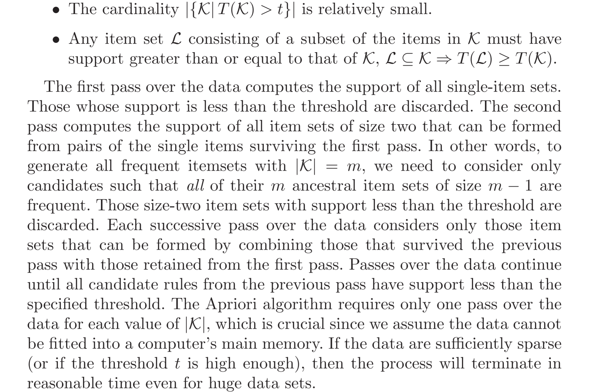
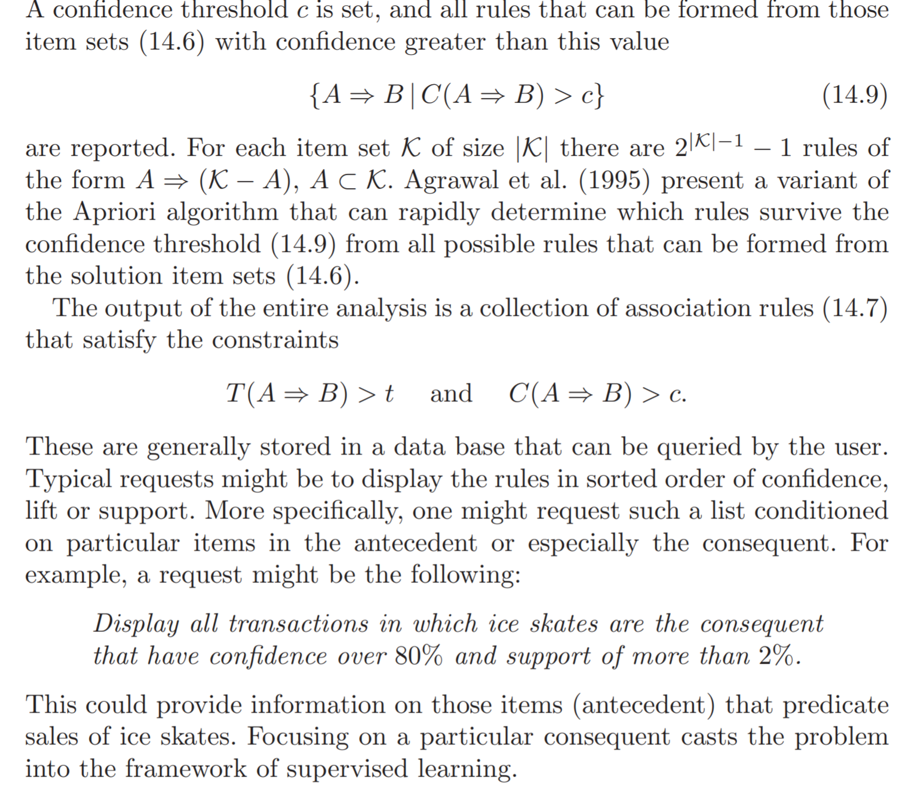

## Introduction

```{r global_options, include=FALSE}
knitr::opts_chunk$set(echo=TRUE, warning=FALSE, message=FALSE)
```

Unsupervised learning - aka "learning without a teacher." is about learning the structure of the explanatory variables $X^{T} = (X_1, \dots , X_p)$. That is we seek to learn the structure of the distribution $P_X(x)$.

When $p$ is low dimension, then one approach is to use non-parametric density estimation to empirically characterize $\hat{P}(x)$. However this fails when $p$ is large due to curse of dimensionality. 

How can we gain insight into $P(x)$ from the data $(x_1, \dots, x_n)$ when $p$ is larger. That is the problem addressed by unsupervised learning. 

The biggest difference between supervised and unsupervised is that there is no obvious criterion for a "successful" characterization of the distribution. The loss function and out of sample performance plays that role in supervised learning - and hence the name *supervised*.

>In the context of unsupervised learning, there is no such
direct measure of success. It is difficult to ascertain the validity of inferences
drawn from the output of most unsupervised learning algorithms. One must
resort to heuristic arguments not only for motivating the algorithms, as is
often the case in supervised learning as well, but also for judgments as to
the quality of the results. This uncomfortable situation has led to heavy
proliferation of proposed methods, since effectiveness is a matter of opinion
and cannot be verified directly.

## Association Rules

>. Association rules attempt
to construct simple descriptions (conjunctive rules) that describe regions
of high density in the special case of very high dimensional binary-valued
data.

It is also naturally applicable to categorical variables, e.g, data with many categorical and binary features. Observe that with a continuous variable $X_i$, you can define splits of the variable to make it categorical, e.g., bin the variable. 

Let $\mathcal{S}_i$ be the support of the $i^{th}$ variable, and $s_i \subset \mathcal{S}_{i}$ be a subset. The problem is to find subsets $s_1, \dots ,s_p$ such that $$P\left[\bigcap_{j} (X_j \in s_j) \right]$$
is relatively large. 

The intersection $\bigcap_{j} (X_j \in s_j)$ is called a *conjunctive rule*. Notice that when $s_{j}  = \mathcal{S}_{j}$, the variable $X_j$ does not appear in the conjunctive rule. 

## Market Basket Analysis

Market Basket Analysis specializes the problem to where $s_j = \mathcal{S}_j$ or $s_j = v_{0j}$, e.g., the whole support or a single value. 

This can be simplified further by converting all discrete valued variables into binary variables. Let $$K = \sum_j|\mathcal{S}_j|$$
be all possible values for variables in the data, and $Z_k$ for $k = 1,\dots, K$ be the corresponding indicator variables associated to an underlying variable and value.

The association rule problem can now be stated as one of finding the subset $\mathcal{K} \subset K$ that makes

$$Pr\left[\prod_{k \in \mathcal{K}} Z_{k} = 1\right]$$
sufficiently large. 

- The set $\mathcal{K}$ is called the **item set**
- The number of variables $Z_k$ in the item set is called the size - note it cannot be bigger than $p$
- The "support" or "prevalence" $T(\mathcal{K})$ of item set $\mathcal{K}$ is given by $$\frac{1}{N}\sum_{i}\left[\prod_{k \in \mathcal{K}} z_{ik}\right]$$

- An observation $i$ for which $\prod_{k \in \mathcal{K}} z_{ik} = 1$ is said to contain the item set $\mathcal{K}$.


The problem is one of finding all item sets $\mathcal{K}_l$ such that $T(\mathcal{K}) > t$ for a lower bound $t$. 

## The Apriori Algorithm



## Association Rules

Each high support item set $\mathcal{K}$ returned by the algorithm can be transformed into a set of **association rules**. 

Partition the $Z_k$ for $k \in \mathcal{K}$ into sets $A$ and $B$ such that $A \cup B = \mathcal{K}$. Then the rule is $$A \implies B$$

$A$ is the **antecedent** and $B$ is the **consequent**. 

An association rule has some defining properties:

- The *support*  $T(A \implies B)$  of the rule is the support of $\mathcal{K}$
- The *confidence* $C(A \implies B)$ of the rule is $$C(A \implies B) = \frac{T(A \implies B)}{T(B)}$$ which is an estimate of $P(B \mid A)$. 
- The *expected confidence* of $A \implies B$ is $T(B)$ which is an estimate of $P(B)$. 
- The *lift* of the rule is defined as confidence divided by expected confidence $$L(A \implies B) = \frac{C(A \implies B)}{T(B)}$$

This is an estimate of the association measure $$\frac{P(A \mbox{ and } B)}{P(A)P(B)}$$

### Example


The algorithm for finding association rules is similar to *apriori*.




There are some important limitations which **generalized association rules** can solve.  


## Empirical Example

Market Basket Analysis is one of the key techniques used by the large retailers that uncovers associations between items by looking for combinations of items that occur together frequently in transactions. In other words, it allows the retailers to identify relationships between the items that people buy.

Association Rules is widely used to analyze retail basket or transaction data, is intended to identify strong rules discovered in transaction data using some measures of interestingness, based on the concept of strong rules.


* Assume there are 100 customers
* 10 out of them bought milk, 8 bought butter and 6 bought both of them. 
* bought milk => bought butter
* Support = P(Milk & Butter) = 6/100 = 0.06
* confidence = support/P(Butter) = 0.06/0.08 = 0.75
* lift = confidence/P(Milk) = 0.75/0.10 = 7.5

Note: this example is extremely small. In practice, a rule needs a support of several hundred transactions before it can be considered statistically significant, and datasets often contain thousands or millions of transactions.


The dataset we are using today comes from [UCI Machine Learning repository](http://archive.ics.uci.edu/ml/datasets/online+retail). The dataset is called “Online Retail” and can be found [here](http://archive.ics.uci.edu/ml/datasets/online+retail). It contains all the transactions occurring between 01/12/2010 and 09/12/2011 for a UK-based and registered online retail.

### Load the packages 

```{r}
library(plyr)
library(tidyverse)
library(readxl)
library(knitr)
library(ggplot2)
library(lubridate)
library(arules)
library(arulesViz)
library(rio)
```

### Data preprocessing and exploring

```{r}
url <- 'http://archive.ics.uci.edu/ml/machine-learning-databases/00352/Online%20Retail.xlsx'
retail <- rio::import(file = url)
retail <- retail[complete.cases(retail), ]
retail <- retail %>% mutate(Description = as.factor(Description))
retail <- retail %>% mutate(Country = as.factor(Country))
retail$Date <- as.Date(retail$InvoiceDate)
retail$Time <- format(retail$InvoiceDate,"%H:%M:%S")
retail$InvoiceNo <- as.numeric(as.character(retail$InvoiceNo))
```

```{r}
glimpse(retail)
str(retail)
```

After preprocessing, the dataset includes 406,829 records and 10 fields: InvoiceNo, StockCode, Description, Quantity, InvoiceDate, UnitPrice, CustomerID, Country, Date, Time.

### What time do people often purchase online?

In order to find the answer to this question, we need to extract "hour" from the time column.

```{r}
retail$Time <- as.factor(retail$Time)
a <- hms(as.character(retail$Time))
retail$Time = hour(a)
retail %>% 
  ggplot(aes(x=Time)) + 
  geom_histogram(stat="count",fill="indianred")
```

There is a clear effect of hour of day on order volume. Most orders happened between 11:00-15:00.

### How many items each customer buy?

People mostly purchase less than 10 items (less than 10 items in each invoice). Those negative numbers should be returns. 

```{r}
detach("package:plyr", unload=TRUE) 
retail %>% 
  group_by(InvoiceNo) %>% 
  summarize(n_items = mean(Quantity)) %>%
  ggplot(aes(x=n_items))+
  geom_histogram(fill="indianred", bins = 100000) + 
  geom_rug()+
  coord_cartesian(xlim=c(0,80))
```

### Top 10 best sellers

```{r}
tmp <- retail %>% 
  group_by(StockCode, Description) %>% 
  summarize(count = n()) %>% 
  arrange(desc(count))
tmp <- head(tmp, n=10)
tmp
tmp %>% 
  ggplot(aes(x=reorder(Description,count), y=count))+
  geom_bar(stat="identity",fill="indian red")+
  coord_flip()
```

### Association rules for online retailer

Before using any rule mining algorithm, we need to transform data from the data frame format into transactions such that we have all the items bought together in one row. For example, this is the format we need:

```{r}
retail_sorted <- retail[order(retail$CustomerID),]
itemList <- plyr::ddply(retail,c("CustomerID","Date"), 
                       function(df1)paste(df1$Description, 
                       collapse = ","))
```

The function ddply() accepts a data frame, splits it into pieces based on one or more factors, computes on the pieces, then returns the results as a data frame. We use "," to separate different items. 

We only need item transactions, so, remove customerID and Date columns.

```{r}
itemList$CustomerID <- NULL
itemList$Date <- NULL
colnames(itemList) <- c("items")
```

Write the data from to a csv file and check whether our transaction format is correct. 

```{r}
write.csv(itemList,"market_basket.csv", quote = FALSE, row.names = TRUE)
```

Perfect! Now we have our transaction dataset shows the matrix of items being bought together. We don't actually see how often they are bought together, we don't see rules either. But we are going to find out. 

Let's have a closer look how many transaction we have and what they are.

```{r}
print('Description of the transactions')
tr <- read.transactions('market_basket.csv', format = 'basket', sep=',')
tr
summary(tr)
```

We see 19,296 transactions, this is the number of rows as well, and 7,881 items, remember items are the product descriptions in our original dataset. Transaction here is the collections or subsets of these 7,881 items. 

The summary gives us some useful information:

* density: The percentage of non-empty cells in the sparse matrix. In another word, the total number of items that purchased divided by the total number of possible items in that matrix. We can calculate how many items were purchased using density like so: 

19296 X 7881 X 0.0022

* The most frequent items should be same with our results in Figure 3.

* For the sizes of the transactions, 2247 transactions for just 1 items, 1147 transactions for 2 items, all the way up to the biggest transaction: 1 transaction for 420 items. This indicates that most customers buy small number of items on each purchase.

* The data distribution is right skewed.

Let's have a look item freqnency plot, this should be in align with Figure 3.

```{r}
itemFrequencyPlot(tr, topN=20, type='absolute')
```

## Create some rules

* We use the Apriori algorithm in arules library to mine frequent itemsets and association rules. The algorithm employs level-wise search for frequent itemsets.

* We pass supp=0.001 and conf=0.8 to return all the rules have a support of at least 0.1% and confidence of at least 80%. 

* We sort the rules by decreasing confidence. 

* Have a look the summary of the rules. 

```{r}
rules <- apriori(tr, parameter = list(supp=0.001, conf=0.8))
rules <- sort(rules, by='confidence', decreasing = TRUE)
summary(rules)
```

* The number of rules: 89,697.
* The distribution of rules by length: Most rules are 6 items long.
* The summary of quality measures: ranges of support, confidence, and lift.
* The information on the data mining: total data mined, and minimum parameters we set earlier.

We have 89,697 rules, I don't want to print them all, let's inspect top 10.

```{r}
inspect(rules[1:10])
```

* 100% customers who bought "WOBBLY CHICKEN" end up bought "DECORATION" as well. 

* 100% customers who bought "BLACK TEA" end up bought "SUGAR JAR" as well. 

And plot these top 10 rules.

```{r}
topRules <- rules[1:10]
plot(topRules)
```

```{r}
plot(topRules, method="graph")
```


