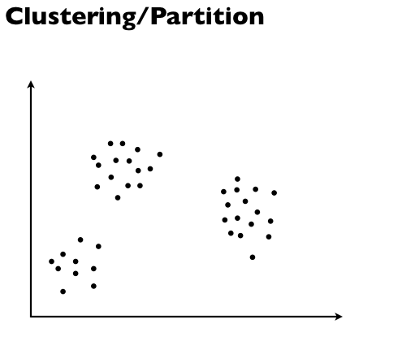
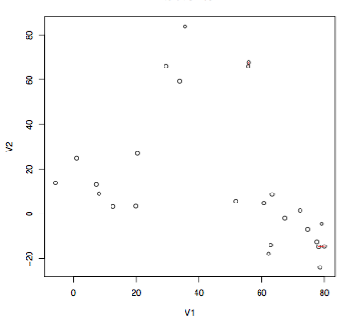
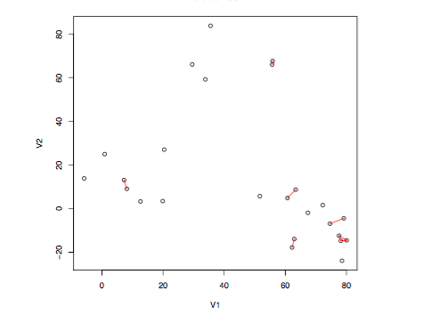
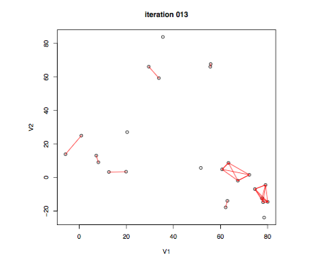
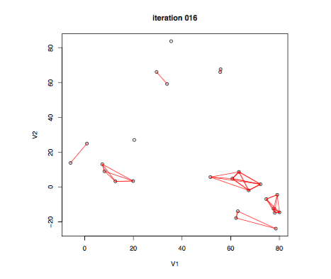
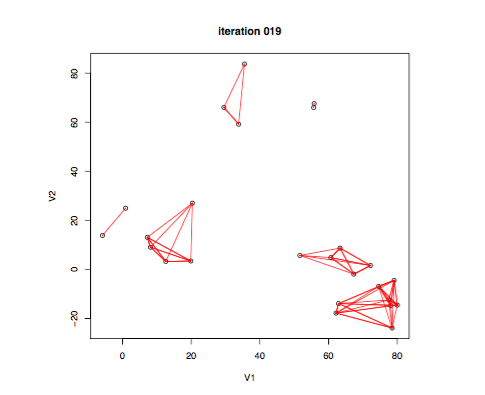
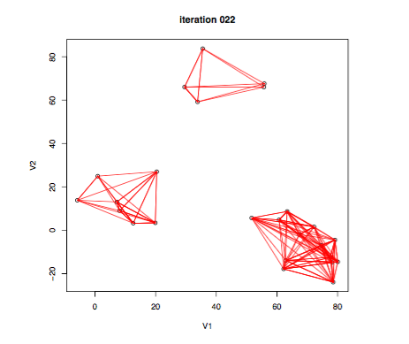
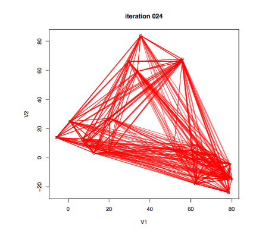

# What is clustering? Why do we use it?




## Purpose

- In clustering, we look at data, where groups are
unknown and undefined, 
- Try to learn the
groups themselves, as well as what differentiates them


 


# Clustering algorithms

We will cover two clustering algorithms that are very simple to understand, visualize, and use. 

The first is the k-means algorithm. 

The second is hierarchical clustering. 

## K-means clustering algorithm

- K-means clustering: simple approach for partitioning a dataset into K distinct, non-overlapping clusters. 
- To perform K-means clustering: specify the desired number of clusters K.
- Then the K-means algorithm will assign each observation to exactly one of the K clusters. 

- Observations $X_1,\ldots X_n$
- dissimilarites $d(X_i,X_j)$ (E.g., think of $X_i \in \R^p$ and $d(X_i,X_j)=\|X_i-X_j\|_2^2$)
- Let $K$ be the number of clusters (fixed).
- A clustering of points
$X_1,\ldots X_n$ is a function $C$ that
assigns each observation $X_i$ to a group $k \in \{1,\ldots K\}$


###  Within-cluster variation

- $C(i)=k$ means that observation $X_i$ is assigned to group $k$
- $|C_k|$ is the number of points in group $k$
- Let $d_{ij} = d(X_i,X_j),$ for some distance function $d.$

The within-cluster variation is defined as 
$$W =  \sum_{k=1}^K 
\frac{1}{|C_k|} \sum_{C(i)=k, \, C(j)=k} d_{ij}$$

Smaller $W$ is better

### Example

Here $n=5$ and $K=2$

$X_i \in \mathbb{R}^2$ and

$d_{ij}=\|X_i-X_j\|_2^2$


- Red clustering:
$W_{\text{red}}=(0.25+0.53+0.52)/3 + 0.25/2 = 0.56$
- Blue clustering:
$W_{\text{blue}}=0.25/2 + (0.10+0.17+0.25)/3 = 0.30$

(Tip: dist function in R)


### Finding the best group assignments

Smaller $W$ is better, so why don't we just directly
find the clustering $C$ that minimizes $W$?

Problem: doing so requires trying 
all possible assignments of the $n$ points into
$K$ groups. The number of possible assignments is


$$A(n,K) = \frac{1}{K!}\sum_{k=1}^K (-1)^{K-k} 
{K \choose k} k^n
$$

Note that $A(10,4)=34,105$, and
$A(25,4) \approx 5 \times 10^{13}$ 

See, Jain and Dubes (1998), "Algorithms for Clustering Data"

Most problems we look at are going to have way 
more than $n=25$ observations, and potentially more
than $K=4$ clusters too (but $K=4$ is not 
unrealistic)

### Finding the best group assignments

How do we get around this? 

<br>

We will end up making an approximation. Let's walk through 
all the details now of K-means clustering. 

### K-means clustering 

- K-means is a simple way to paritition a data set into $K$ distinct, non-overlapping clusters. 

- To perform K-means clustering, we must 

1. first specify the desired number of clusters K
2. then the K-means algorithm will assign each observation to exactly one of the K clusters.

How does this work? 

### Notation

Let $n$ denote the number of data points in our data set. 

Let $$C_1, C_2,
\ldots C_k$$ denoting sets containing the indices of the observations in each cluster. (This means that each data point is in only one cluster $C_j$). 

This means that these sets satisfy two properties:
  
1. $$C_1 \cup C_2 \cup \cdots C_K = \{1,\ldots,n\}.$$
This means that each observations belongs to at least one of the $K$ clusters. 
  
2. $$C_k \cap C_{k^{\prime}} = \emptyset$$ for all $k \neq k^{\prime}.$
This means the clusters are non-overlapping and so no observation belongs to more than one cluster. 

### Intuition

As an example, if the $i$th observation is in cluster $k$ then data point $i \in C_k.$

We think of k-means being a good clustering algorithm when the within-cluster variation is as small as possible. 

What is this? 

### The within cluster variation

The within cluster variation of cluster $C_k$ is a measure of $W(C_k)$ of the amount by which the observations within a cluster differ from each other.

Mathematically, we want to solve the following optimization problem:

$$\min_{C_1,\ldots,C_K} \sum_{k=1}^K W(C_k)$$

In words, this means that we want to partition the data points into clusters such that the total within-cluster variation summed over all $K$ clusters is as small as possible. 

This seems reasonable, but how do we define the within-cluster variation $W(C_k)$? Thoughts? 


There are many possible ways to define this concept, but by far the most common choice involves squared Euclidean distance. 


Thus, we define 

$$W(C_k) = \frac{1}{|C_k|} \sum_{i,i^{\prime}} \sum_{j=1}^p(x_{ij} - x_{i^{\prime}j})^2$$

where $|C_k|$ denotes the number of observations in the kth cluster.

In words, the within-cluster variation for the $k$th cluster is the sum of all of the pairwise squared Euclidean distances between the observations in the $k$th cluster, divided by the total number of observations in the $k$th cluster.

### Back to the optimization problem

We return now to the optimization problem that defines $K$-means clustering (under the Euclidean norm):

\begin{align}
\min_{C_1,\ldots,C_K} \sum_{k=1}^K W(C_k)
&=
\min_{C_1,\ldots,C_K} \{ \sum_{k=1}^K
\frac{1}{|C_k|} \sum_{i,i^{\prime}} \sum_{j=1}^p(x_{ij} - x_{i^{\prime}j})^2
\}
\end{align}

Now, we would like to find an algorithm to solve the above equation. 

That is, we want a method to partition the observations into K clusters such that the objective is minimized.


This is in fact a very difficult problem to solve precisely, since there are almost $K^n$ ways to partition $n$ data points into $K$ clusters. 

This is a very large number unless $K$ and $n$ are both small. (In practice, they are not)! 

Fortunately, a very simple algorithm can be shown to provide a local optimum --- a pretty good solution --- to the K-means optimization problem. 

### K-means clustering algorithm

1. Randomly assign a number, from 1 to $K$, to each of the observations. These serve as initial cluster assignments for the observations. 
2.  Iterate until the clustering algorithm stops changing: 

- For each of the $K$ clusters, compute the centroid. The $k$th cluster centriod is the vector of the $p$ feature averages for the observations in the cluster $k$. 

- Assign each observation to the cluster whose centroid is closest (where closest is defined using Euclidean distance).

Note: 
$\bar{x}_{kj} = \frac{1}{|C_k|} \sum_{i\in C_k} x_{ij}$
is the average for feature $j$ in cluster $C_k.$


### K-means clustering algorithm
The above algorithm is guaranteed to decrease the value of the objective function at each step. 

Why is this true? 

\begin{align}
\frac{1}{|C_k|} \sum_{i,i^{\prime} \in C_k} \sum_{j=1}^p(x_{ij} - x_{i^{\prime}j})^2
&= 2 \sum_{i \in C_k} \sum_{j=1}^p (x_{ij} - \bar{x}_{kj})^2,
\end{align}
where 
$\bar{x}_{kj} = \frac{1}{|C_k|} \sum_{i\in C_k} x_{ij}$
is the mean for data point (feature) $j$ in cluster $C_k.$


- In Step 2(a), the cluster means for each data point are the constants that minimize the sum of squared deviations

- In Step 2(b), reallocating the data points can only improve the the within sum of squares. 

- This means that as the algorithm is run, the clustering obtained will continually improve until the result no longer changes and the objective of equation \ref{eqn:kmeans} will never increase! 

- When the result no longer changes, we reach a local optimum. 

Since the algorithm reaches a local optimum and not a global optimum, the results obtained will depend on the initial (random) cluster assignment of each observation in Step 1.

- Due to this, it's crucial to run the algorithm many times and from multiple (random) starting points.

- One should select the best solution, namely, the one where the objective function is the smallest. 

```{r, fig.cap="Top left: the data is shown. Top center: in Step 1 of the algorithm, each observation is randomly assigned to a cluster. Top right: in Step 2(a), the cluster centroids are computed. These are shown as large colored disks. Initially the centroids are almost completely overlapping because the initial cluster assignments were chosen at random."}

knitr::include_graphics("pics/kmeans1.png")
```

```{r, fig.cap="Bottom left: in Step 2(b), each observation is assigned to the nearest centroid. Bottom center: Step 2(a) is once again performed, leading to new cluster centroids. Bottom right: the results obtained after ten iterations."}

knitr::include_graphics("pics/kmeans2.png")
```

```{r, fig.cap="K-means clustering performed six times; K = 3, each time with a different random assignment of the observations in Step 1 of the K-means algorithm. Above each plot is the value of the objective. Those labeled in red all achieved the same best solution, with an objective value of 235.8."}


```

### Application

We begin with a simple simulated example in which there truly are two clusters in the data: the first 25 observations have a mean shift relative to the next 25 observations.

```{r}
# simulated some data
set.seed(2)
x=matrix(rnorm(50*2), ncol=2)
x[1:25,1]=x[1:25,1]+3
x[1:25,2]=x[1:25,2]-4
```

### Perform K-means clustering, $K=2$

```{r}
km.out=kmeans(x,centers= 2,nstart=20)
```

- centers is the number of clusters $K$.
- nstart tells us how many sets should be chosen. 

### Perform K-means clustering, $K=2$

The cluster assignments of the 50 observations can be found by the following:

```{r}
km.out$cluster
```

The K-means clustering perfectly separated the observations into two clusters even though we did not supply any group information to kmeans

### Plotting with cluster assignment


```{r}
plot(x, col=(km.out$cluster +1), main="", xlab="", ylab="", pch=20, cex=2)
```

Here the observations can be easily plotted because they are two-dimensional. If there were more than two variables then we could instead perform PCA and plot the first two principal components score vectors.

### Other values of $K$

Here, we alread knew the value of $K$ because we simulated the data and in general we don't know $K$, so we need to play around with this value. 

What happens if we look at $K=3.$

$K=3$ for simulated example


```{r}
set.seed(4)
km.out=kmeans(x,3,nstart=20)
km.out
```

### More about k-means

- To run the kmeans() function in R with multiple initial cluster assignments, we use the nstart argument. 

- If a value of nstart greater than one is used, then K-means clustering will be performed using multiple random assignments in Step 1 of Algorithm 10.1, and the kmeans() function will report only the best results. 

Here we compare using nstart$=1$ to nstart$=20.$

### Varying the nstart value

```{r}
set.seed(3)
km.out=kmeans(x,3,nstart=1)
km.out$tot.withinss
km.out=kmeans(x,3,nstart=20)
km.out$tot.withinss
```
-  km.out$tot.withinss is the total within-cluster sum of squares, which we seek to minimize by performing K-means clustering

- The individual within-cluster sum-of-squares are contained in the vector km.out$withinss.

### Recommended settings

- Recommend always running K-means clustering with a large value of nstart, such as 20 or 50, since otherwise an undesirable local optimum may be obtained.

- Make sure you always set a random seed as well so that you can reproduce your results.


###  Difficult questions posed by K-means

- The main question that is posed by k-means is how many clusters $K$ should we choose? 

- Anytime we make such a choice regarding $K$, this can have a 
strong impact on the results obtained. 

- In practice, we try several different choices, and look for the one with the most useful or interpretable solution. 

- With these methods, there is no single right answer—any solution that exposes some interesting aspects of the data should be considered.

### Validating the Clusters Obtained

- Any time clustering is performed on a data set we will find clusters. 

- But we really want to know whether the clusters that have been found represent true subgroups in the data, or whether they are simply a result of clustering the noise. 

- For instance, if we were to obtain an independent set of observations, then would those observations also display the same set of clusters? 

- There exist a number of techniques for assigning a p-value to a cluster in order to assess whether there is more evidence for the cluster than one would expect due to chance. 

- However, there has been no consensus on a single best approach. More details can be found in Hastie et al. (2009).

### Other Considerations in Clustering

- Both K-means and hierarchical clustering will assign each observation to a cluster. 

- However, sometimes this might not be appropriate. 

- For instance, suppose that most of the observations truly belong to a small number of (unknown) subgroups, and a small subset of the observations are quite different from each other and from all other observations. 

- Then since K-means and hierarchical clustering force every observation into a cluster, the clusters found may be heavily distorted due to the presence of outliers that do not belong to any cluster. 

- Mixture models are an attractive approach for accommodating the presence of such outliers. 

- These amount to a soft version of K-means clustering, and are described in Hastie et al. (2009). 


## K-Medioids

In $K$-means, cluster centers are averages

A cluster center is representative for all 
points in a cluster, also called a 
<font color = "red">  prototype </font>


In $K$-means, we simply take a cluster center to be 
the <font color = "red">  average </font> of points in the cluster.
Great for computational purposes---but how
does it lend to <font color = "red"> interpretation </font>

<br>

This would be fine if we were clustering, e.g., houses based on features like price, square footage,
number of bedrooms, distance to nearest bus stop, etc.

<br>

Not so if we were clustering faces


### $K$-medoids algorithm}

- In some applications we want each center
to be **one of the points*** itself.

- This is where $K$-medoids comes in

- An algorithm similar to 
the $K$-means algorithm but when fitting the centers $c_1,\ldots c_K$, we restrict our
attention to the points themselves


Select initial guess for centers $c_1,\ldots c_K$ (e.g., randomly
select $K$ of the points $X_1,\ldots X_n$), then repeat:

1. **Minimize** over $C$: for each  
$i=1,\ldots n$, find the cluster center $c_k$ closest 
to $X_i$, and let $C(i)=k$

2. **Minimize** over $c_1,\ldots c_K$}: for each 
$k=1,\ldots K$, let $c_k = X^*_k$, the
<font color = "red"> medoid </font> of points in cluster $k$, i.e., the point 
$X_i$ in cluster $k$ that minimizes
$\sum_{C(j)=k} \|X_j-X_i\|_2^2$

Stop when within-cluster variation doesn't change

<br>
In words:
1. Cluster (label) each point based on the closest center
2. Replace each center by the medoid of points in its cluster

### Example


Note: only 3 points had different labels under $K$-means


### Properties of $K$-medoids
The $K$-medoids algorithm  shares the properties
of $K$-means that we discussed (each iteration 
decreases the criterion; the algorithm
always converges; different starts gives
different final answers; it does 
not achieve the global minimum)

<br>

$K$-medoids generally returns
a **higher value** of 
$$\sum_{k=1}^K \sum_{C(i)=k} \|X_i-c_k\|_2^2$$
than does $K$-means (why?).

<br>

Also, $K$-medoids is  **computationally
harder** than $K$-means (because of step 
2: computing the medoid is harder than
computing the average)

<br>

Remember, $K$-medoids has the (potentially 
important) property that the centers are located among
the data points themselves

The K-medoids algorithm is implemented by the function
`pam` (stands “for partitioning around medoids”) in the package
cluster

# From K-means to Hierarchical clustering 

Recall two properties of K-means clustering:
- It fits exactly $K$ clusters (as specified)

- Final clustering assignment depends on the chosen initial cluster centers

<br>

- Assume pairwise dissimilarites $d_{ij}$ between data
points.

-   **Hierarchical clustering** produces a consistent result, without the need to choose initial
starting positions (number of clusters).


<<font color= "red"> Catch </font>: choose a way to measure the 
dissimilarity between groups, called the linkage

- Given the linkage, hierarchical clustering
produces a sequence of clustering assignments. 

- At one end, all points are in their own cluster, at the other end, all points are in one cluster


## Agglomerative vs divisive clustering

**Agglomerative** (i.e., bottom-up):
- Start with all points in their own group
- Until there is only one cluster, repeatedly:
merge the two groups that have the smallest
dissimilarity


**Divisive** (i.e., top-down):
- Start with all points in one cluster
- Until all points are in their own cluster, 
repeatedly: split the group into two resulting
in the biggest dissimilarity


Agglomerative strategies are simpler,
we'll focus on them. Divisive methods are still 
important.

## Simple example

Given these data points,
an agglomerative algorithm might decide
on a clustering sequence as follows:


## Example























## When to stop?

Suppose you are using the above algorithm to cluster the data points in groups. 

- How do you know when to stop? 
- How should we compare the data points? 

- Each level of the resulting tree is a segmentation of the data
-  The algorithm results in a sequence of groupings
-  It is up to the user to choose a "natural" clustering from this sequence

## Dendogram

We can also represent the sequence of clustering assignments as a 
dendrogram:


Note that cutting the dendrogram horizontally
partitions the data points into clusters

- Agglomerative clustering is monotonic

- The similarity between merged clusters is monotone decreasing
with the level of the merge.

- Dendrogram: Plot each merge at the (negative) similarity between the two merged groups

- Provides an interpretable visualization of the algorithm and data

- Useful summarization tool, part of why hierarchical clustering is popular

## Group similarity

Given a distance similarity measure (say, Eucliclean) between points, the user has many choices on how to define intergroup similarity. 

1. Single linkage: the similiarity of the closest pair
$$ d_{SL}(G,H) = \min_{i\in G, j \in H} d_{i,j}$$

2. Complete linkage: the similarity of the furthest pair
$$d_{CL}(G,H) = \max_{i\in G, j \in H} d_{i,j}$$

3. Group-average: the average similarity between groups
$$d_{GA} = \frac{1}{N_G N_H}\sum_{i \in G}\sum_{j \in H}d_{i,j}$$


### Single Linkage

In single linkage 
(i.e., nearest-neighbor linkage), the dissimilarity
between $G,H$ is the smallest dissimilarity 
between two points in opposite groups:
$$d_{\text{single}}(G,H) = 
\min_{i \in G, \, j \in H} d_{ij}$$


Example (dissimilarities $d_{ij}$ are distances,
groups are marked by colors): single linkage score 
$d_{\text{single}}(G,H)$ is the 
distance of the closest pair} 


Here $n=60$, $X_i \in \R^2$, $d_{ij}=\|X_i-X_j\|_2$.
Cutting the tree at $h=0.9$ gives the 
clustering assignments marked by colors


Cut interpretation:
for each point $X_i$, there is another point $X_j$ 
in its cluster with $d_{ij} \leq 0.9$

### Complete Linkage

In complete linkage (i.e., 
furthest-neighbor linkage), dissimilarity
between $G,H$ is the largest dissimilarity 
between two points in opposite groups:
$$d_{\text{complete}}(G,H) = 
\max_{i \in G, \, j \in H} d_{ij}$$


Example (dissimilarities $d_{ij}$ are distances,
groups are marked by colors): complete linkage score 
$d_{\text{complete}}(G,H)$ is the 
distance of the furthest pair.


Cutting the tree at $h=5$ gives the 
clustering assignments marked by colors


Cut interpretation:
for each point $X_i$, every other point $X_j$ in its
cluster satisfies $d_{ij} \leq 5$


### Average Linkage

In average linkage, the dissimilarity
between $G,H$ is the average dissimilarity 
over all points in opposite groups:
$$d_{\text{average}}(G,H) = 
\frac{1}{n_G \cdot n_H}
\sum_{i \in G, \, j \in H} d_{ij}$$


Example (dissimilarities $d_{ij}$ are distances,
groups are marked by colors): average linkage score 
$d_{\text{average}}(G,H)$ is the  
average distance across all pairs

(Plot here only shows distances between 
the blue points and one red point)} 


Same data as before. Cutting the tree at $h=2.5$ gives 
clustering assignments marked by the colors


Cut interpretation: 
there really isn't a good one! 


## Properties of intergroup similarity

- Single linkage can produce "chaining," where a sequence of close observations in different groups cause early merges of those groups

- Complete linkage has the opposite problem. It might not merge close groups because of outlier members that are far apart.

- Group average represents a natural compromise, but depends on the scale of the similarities. Applying a monotone transformation to the similarities can change the results.

## Things to consider

- Hierarchical clustering should be treated with caution.
- Different decisions about group similarities can lead to vastly
different dendrograms.
- The algorithm imposes a hierarchical structure on the data, even data for which such structure is not appropriate.


## Application on genomic data


- Unsupervised methods are often used in the analysis of genomic data. 

- PCA and hierarchical clustering are very common tools. We will explore both on a genomic data set. 

- We illustrate these methods on the NCI60 cancer cell line microarray data, which consists of 6,830 gene expression measurements on 64 cancer cell lines. 

### Background on gene expression levels


A gene is a stretch of DNA inside the cell that tells the cell how to make a specific protein. 

All cells in the body contain the same genes, but they do not always make the same proteins in the same quantities

The genes have different expression levels in different cell types, and cells can regulate gene expression levels in response to their environment. 


Different types of cells thus have different expression profiles. 

Many diseases, including cancer, fundamentally involve breakdowns in the regulation of gene expression. 

The expression profile of cancer cells becomes abnormal, and different kinds of cancers have different expression profiles. (The exception are red blood cells, which do not contain DNA)

### Gene expression data


Our data are gene expression measurements from cells drawn from 64 different tumors (from 64 different patients). 

In each case, a device called a microarray (or gene chip) measured the expression of each of 6830 distinct genes.

### Class types of gene expression data


The cells mostly come from known cancer types, so there are classes, in addition to the measurements of the expression levels. 

The classes are breast, cns (central nervous system), colon, leukemia, melanoma, nsclc (non-small- cell lung cancer), ovarian, prostate, renal, K562A, K562B, MCF7A, MCF7D (those four are laboratory tumor cultures) and unknown.

### Application on gene expression data

Note you will need to install via `install.packages(pkgs="ElemStatLearn_2015.6.26.tar.gz", type="source", repos=NULL)`

```{r}
library(ElemStatLearn)
data(nci)
head(nci)
# transpose the data for clustering
nci.t <- t(nci)
# columns are cancer types
# rows are the patient 
```

### Task 1: Hierarchical Clustering to NCI60 Data


Produce dendrograms using single-link clustering and complete-link clustering, and average link clustering. Make sure the figures are legible. (Try the cex=0.5 option to plot.)

Remark: hclust needs a matrix of distances, handily produced by the dist function, so let's make sure to remember to use this. 

### Creating distances

```{r}
# does euc. dist by default 
nci.dist <- dist(nci.t)
head(nci.dist)
```

### Complete Linkage

```{r, echo=TRUE}
plot(hclust(nci.dist, method="complete"), cex=0.5, main="Complete Linkage", xlab="Cells", sub="",ylab="")
```

### Average Linkage

```{r, echo=TRUE}
plot(hclust(nci.dist, method="average"), cex=0.5,
main="Average Linkage", xlab="", sub="",ylab="")
```

### Single Linkage

```{r, echo=TRUE}
plot(hclust(nci.dist, method="single"), cex=0.5,
main="Single Linkage", xlab="", sub="",ylab="")
```

### Question

Which cell classes seem are best captured by each clustering method?

1. Complete-linkage has nice sub-trees for COLON, LEUKEMIA, MELANOMA, and RENAL. 
2. Average linkage has similar resuls to complete linkage. 
3. Single-linkage is good with RENAL and decent with MELANOMA (though confused with BREAST). There are little sub-trees of cells of the same time, like COLON or CNS, but mixed together with others. 

### Complete and average linkage versus single linkage


- Typically, single linkage will tend to yield trailing clusters: very large clusters onto which individual observations attach one-by-one.
- On the other hand, complete and average linkage tend to yield more balanced, attractive clusters
- For this reason, complete and average linkage are generally preferred to single linkage.

### Height and sum of the within-cluster sums of squares relationship


The hclust command returns an object whose height attribute is the sum of the within-cluster sums of squares. How many clusters does this suggest we should use, according to complete linkage?


```{r}
nci.complete = hclust(nci.dist, method="complete")
length(nci.complete$height)
nci.complete$height[1]
```

There are 63 “heights”, corresponding to the 63 joinings, i.e., not in- cluding the height (sum-of-squares) of zero when we have 64 clusters,
one for each data point. Since the merging costs are differences, we want to add an initial 0 to the sequence.

### Optimal number of clusters

```{r, echo=FALSE, fig.width=4, fig.height=3}
# takes the difference between 
#successive components in a vector
merging.costs <- diff(c(0,nci.complete$height))
plot(64:2,merging.costs, xlab="Clusters remaining",ylab="Merging cost"
     ,type="l")
```

The heuristic is to stop joining clusters when the cost of doing so goes up a lot.  

This suggests using only 10 clusters, since going from 10 clusters to 9 is very expensive. (Alternately, use 63 clusters; but that would be silly.)

