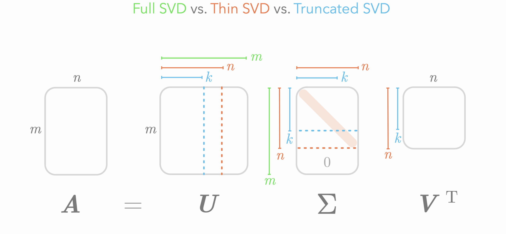
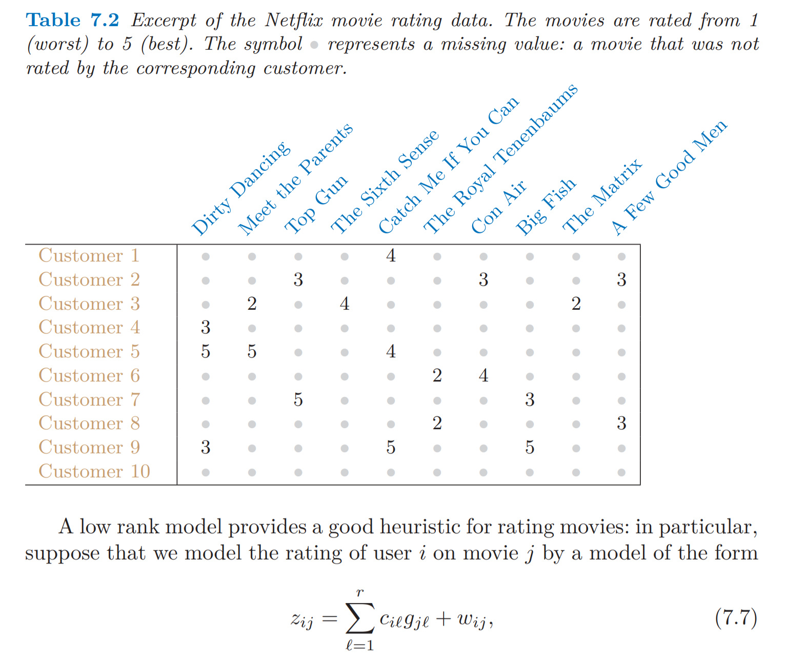
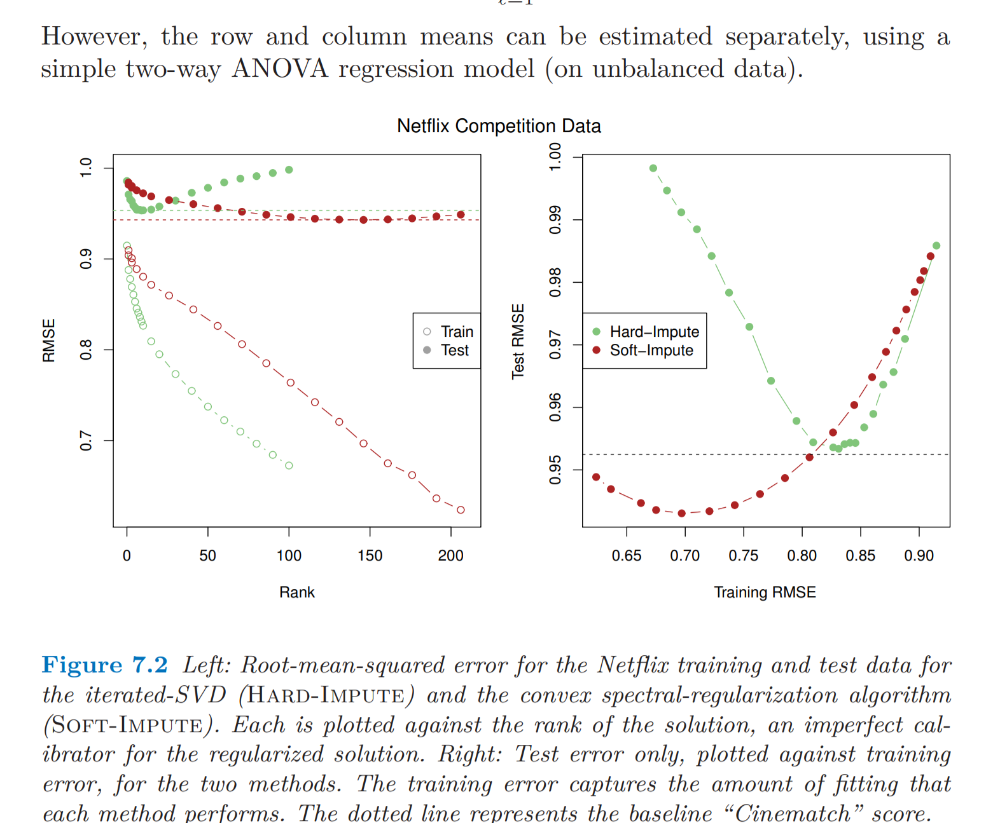
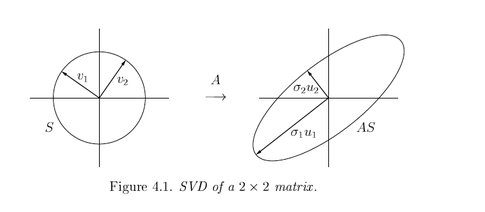
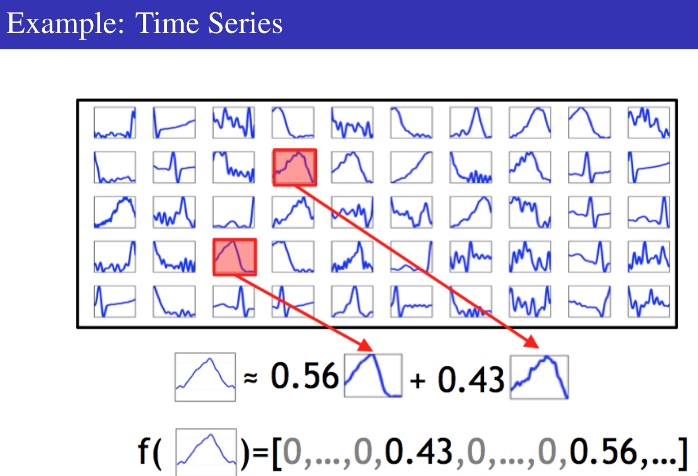
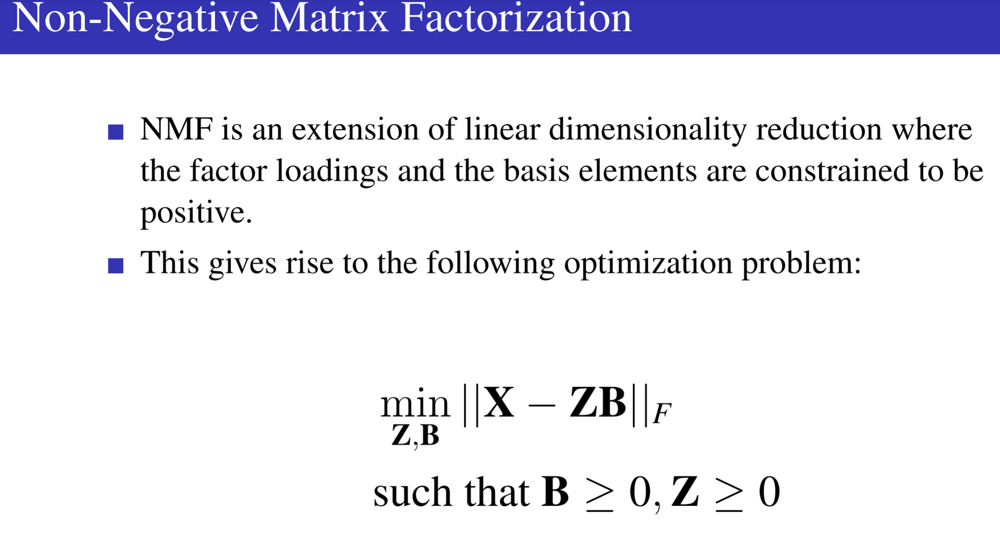
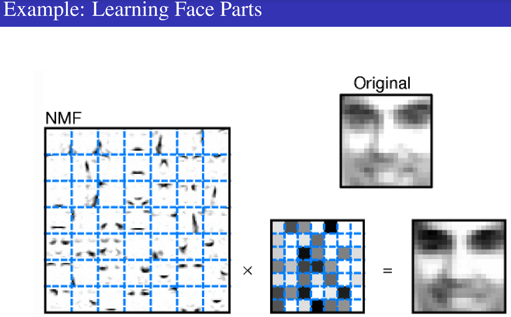

```{r setup, include=FALSE}
knitr::opts_chunk$set(echo = TRUE)
```

The Singular Value Decomposition (SVD) provides a source of insight into the determinants of the variation in tabular (rectangular) data. It is a matrix decomposition rooted in the *fundamental theorem of linear algebra* (FTLA) as discussed in the wonderful [paper](https://www.engineering.iastate.edu/~julied/classes/CE570/Notes/strangpaper.pdf) by Gilbert Strang. 

# SVD

## Matrices and Linear Transformations

A matrix $A \in \mathbb{R}^{n \times m}$ can be thought of as
a linear mapping between two spaces:
\begin{align*}
A: \mathbb{R}^m \rightarrow \mathbb{R}^n
\end{align*}

The interpretation requires no assumptions on the shape or
structure of the matrix $A$.

## Singular Value Decomposition

The singular value decomposition writes the matrix $A$ as a product
of three matrices:

\begin{align*}
A &= U \Sigma V^t
\end{align*}

Where $U \in \mathbb{R}^{n\times n}$ and $V \in \mathbb{R}^{m\times m}$
are orthonormal matricies and $\Sigma$ is the rectangular diagonal matrix
$\text{diag}(\sigma_1, \sigma_2, \ldots, \sigma_{\text{min}(n,m)})$.

This decomposition exists for any real matrix $A$.

## Singular Vectors

The vectors $U = (u_1, \dots, u_n)$ for $u_{i} \in \mathbb{R}^n$ are the left singular vectors. 

- They are the eigenvectors of $XX^{\prime}$.

The vectors $V = (v_1, \dots, v_m)$ for $v_j \in \mathbb{R}^m$ are the right singular vectors. 

- They are the eigenvectors of $X^{\prime}X$


## Singluar Values

By convention, the values of $\Sigma$ are arranged in decending
order: $\sigma_1 \geq \sigma_2 \geq \cdots \geq \sigma_{\text{min}(n,m)}$.

These are called the **singular values** of the matrix $A$.

The number of non-zero singular values is equal to the rank $r$ of the
matrix $A$.

## SVD Visual



## Low-rank Matrix Approximation

The singular value decomposition allows us to write the matrix $A$ as a sum
of $r$, rank $1$ matricies:

\begin{align*}
A &= \sum_i^{r=\text{rank}(A)} \sigma_i u_i v_i^t
\end{align*}

This is an exact decomposition. 

The optimal rank $r^{\ast} < r$ approximation to $X$ (based on the Frobenius norm) is 

$$\hat{A} = \sum_i^{r^{\ast}} \sigma_i u_i v_i^t$$

### Netflix Challenge and Matrix Completion

The low rank approximation via SVD was a critical ingredient of the winner of the [Netflix Challenge](http://www.solverworld.com/the-netflix-prize-singular-values-for-1-million/)






## What is special about the singular vectors?

A useful way of viewing the singular value decomposition is to think about
what would happen when projecting columns of $U$ and $V$:

\begin{align*}
A v_i &= \sigma_i u_i \\
A^t u_i &= \sigma_i v_i
\end{align*}

Notice that both equations use $\sigma_i$!

## Diagnonalizing $A$

Therefore, if we have an arbitrary vector $z \in \mathbb{R}^m$
and we write it in the basis of $V$:

\begin{align*}
z &= \sum_i \alpha_i v_i
\end{align*}

The mapping of $A$ can then be easily calculated in the coordinate system
of $U$:

\begin{align*}
Az &= \sum_i \alpha_i \sigma_i u_i
\end{align*}

Due to the linearity of the matrix operation.

## A Picture



## Simple Example

```{r}
A <- matrix(1:6,ncol=3)
A

SVD <- svd(A, nu=2, nv=3)
Sigma <- cbind(diag(SVD$d),0)
U <- SVD$u
V <- SVD$v
A - U %*% Sigma %*% t(V)
```

## Unit Ball

```{r}
N <- 1e4
p <- 3
unitBall <- matrix(runif(N * p, -1, 1), nrow=3)
unitBall <- unitBall[,apply(unitBall^2, 2, sum) < 1]
unitBall[,1:4]
```

## Picture

```{r}
projUnitBall <- t(A %*% unitBall)
plot(projUnitBall,pch=".")
```

## Another Picture

```{r}
v1 <- (A %*% V)[,1]
v2 <- (A %*% V)[,2]
plot(projUnitBall,pch=".")
arrows(0,0,v1[1],v1[2],col="red",lwd=2)
arrows(0,0,v2[1],v2[2],col="green",lwd=2)
```

## Least Squares and SVD

The standard formulation of least squares projection involves the matrix inverse of $X^tX$:

\begin{align*}
 \widehat{\beta} &= (X^t X)^{-1} X^t y
\end{align*}

## Problem

Why might this be a problem? Well, consider the simple case where
we have $n = p = 2$ with the following:

\begin{align*}
X &= \left( \begin{array}{cc} 10^9 & -1 \\ -1 & 10^{-5} \end{array}\right) \\
\beta &= \left( \begin{array}{c} 1 \\ 1 \end{array}\right)
\end{align*}

For simplicity, we'll even assume that there is no noise vector. Then we have:

\begin{align*}
y &= \left( \begin{array}{cc} 10^9 & -1 \\ -1 & 10^{-5} \end{array}\right) * \left( \begin{array}{c} 1 \\ 1 \end{array}\right) \\
&= \left( \begin{array}{c} 10^9 - 1 \\ -0.99999 \end{array}\right)
\end{align*}

## What happens in R

```{r}
X  <- matrix(c(10^9, -1, -1, 10^(-5)), 2, 2)
beta <- c(1,1)
y <- X %*% beta
Xinv <- solve(X)
Xinv %*% y
```

## Alternatively

However, what if we try to calculate this with the normal
equations? Here we need to invert the matrix $X^t X$.

```{r, eval=FALSE}
XtXinv <- solve(t(X) %*% X)
```

```
Error in solve.default(t(X) %*% X) :
  system is computationally singular: reciprocal condition number = 8.09999e-23
```

R knows that this is not going to be good, and refuses to
calculate the inverse by default.

## What if we ignore the warning

Suppose that we turn off this warning (by setting the tolerance
to zero); what happens?

```{r}
XtXinv <- solve(t(X) %*% X, tol=0)
Xty <- t(X) %*% y
XtXinv %*% Xty
```

## What is happening

In a linear model, we only observe $X \beta$, rather than $\beta$ itself.
There can be difficult numerical problems that arise when $X\beta$'s are very similar for regression vectors $\beta$
that are quite different.


## What is happening

We  wish to control the ratio of the relative error in
estimation to that of projection: \pause

\begin{align*}
\frac{\text{rel. error estimation}}{\text{rel. error projection}}
 &= \frac{|| \beta + \Delta ||_2 / || \beta ||_2}{|| X(\beta + \Delta) ||_2 / || X\beta ||_2}
 < \epsilon
\end{align*}

So we do not want large changes in $\Delta$ to yield relatively small changes in the prediction space $X\beta$.


Notice that we can re-arrange the equation as:

\begin{align*}
\frac{|| \beta + \Delta ||_2 / || X(\beta + \Delta) ||_2}{|| \beta ||_2 / || X\beta ||_2}
\end{align*}

A bound is found by taking the upper bound on the numerator and an lower bound on the
denominator.

## Recovering Bounds

Suppos we map $x$ to $Ax$. How *different" is the size of $Ax$ in comparison to $x$. 

\begin{align*}
\frac{|| Ax ||_2}{||x||_2}
\end{align*}

Let $x = \sum_i \alpha_i v_i$. Then:

\begin{align*}
\frac{|| Ax ||_2}{||x||_2}
  &= \sqrt{\frac{\sum_i \sigma_i^2 \alpha_i^2 ||u_i||^2}{\sum_i \alpha_i^2 ||v_i||^2}}
\end{align*}

\pause The change of basis to $\{v_{i}\}$ is norm preserving. We can see that the minimum occurs when $x$ is equal to $v_{\text{min}(n,m)}$.

Likewise, the maximum occurs when $x$ is equal to $v_1$.

## Condition Number

\begin{align*}
\frac{\text{rel. error estimation}}{\text{rel. error projection}} \leq \frac{\sigma_{max}}{\sigma_{min}}
\end{align*}

This is called the *condition number* of the matrix $A$, and was the
quantity R complained about when we tried to invert an ill-conditioned
matrix.

## SVD and the Normal Equations

If we take the SVD of the data matrix $X$, we have

\begin{align}
X &= U D V^t.
\end{align}

Plugging this into the ordinary least squares estimator gives:

\begin{align}
\beta &= (X^t X)^{-1} X^t y \\
&= (V D^t U^t U D V^t)^{-1} V D^t U^t y \\
&= (V D^t (U^t U) D V^t)^{-1} V D U^t y \\
&= (V D^t I_p D V^t)^{-1} V D U^t y \\
&= (V D^2 V^t)^{-1} V D U^t y
\end{align}

## Simplification

By taking the fact that a diagonal matrix is its own transpose and using that
$U^t U$ is equal to the identity. Note that $D^2$ is just a matrix with the
squared singular values along the diagonal.

Now, notice that the inverse of $V$ is $V^t$, and vice-versa. Further, the
inverse of $D^{2}$ is equal to a diagonal matrix with the inverse of the
squared singular values along the diagonal (this exists if we assume that
$\sigma_1 > 0$). Therefore:

\begin{align}
(V D^2 V^t)^{-1} &= (V^{t})^{-1} D^{-2} V^{-1} = V D^{-2} V^t
\end{align}

## Further Simplification

And we can further simplify the equation for the ordinary least squares
estimator:

\begin{align}
\beta &= (V D^2 V^t)^{-1} V D U^t y \\
&= V D^{-2} V^t V D U^t y \\
&= V D^{-2} D U^t y \\
&= V D^{-1} U^t y.
\end{align}

This gives us a compact way to write the ordinary least squares estimator.
It is also far more numerically stable to use this formula to compute the
estimate $\beta$ from a dataset. 

## Least squares and SVD: Example

Lets simulate data generated by a linear model

```{r}
set.seed(1)
n <- 1e4; p <- 6
X <- matrix(rnorm(n*p), ncol = p)
X[,1] <- X[,1] * (0.01) + X[,2] * (0.99)
b <- c(1,2,3,4,5,6)
epsilon <- rnorm(n)
y <- X %*% b + epsilon
```

And take the SVD of the matrix `X`:

```{r}
svd_output <- svd(X)
U <- svd_output[["u"]]
V <- svd_output[["v"]]
sigma <- svd_output[["d"]]
```

Verify that the matrix $V^t V$ is equal to the identity (note that it will only
be close the identity because of numerical error):

```{r}
t(V) %*% V
```

Rounding to the 10th decimal place shows the result more clearly:

```{r}
round(t(V) %*% V, 10)
```

Then, run the following code to verify that all of the dimensions are exactly as we
would expect:

```{r}
{
  cat("Dimension of X: ")
  cat(paste(dim(X), collapse = " by "))
  
  cat("\nDimension of U: ") 
  cat(paste(dim(U), collapse = " by "))
  
  cat("\nDimension of V: ")
  cat(paste(dim(V), collapse = " by "))
  
  cat("\nLength of singular values: ")
  cat(length(sigma))
}
```

The following code computes the least squares coefficents using the
matrix $X$ and the response vector $y$:

```{r}
lm.fit(X, y)$coefficients
```

Compute the same equation using the SVD formula for $\beta$:

```{r}
V %*% diag(1 / sigma) %*% t(U) %*% y
```

### Maximum values

I want to simulate the size of $|| X v ||_2^2$ where $v$ is in the unit
ball of dimension 6. 

```{r}
N <- 100000                     # number of experiments to run
norms <- rep(0, length=N)       # empty vector to store results in 
for (i in seq_len(N))
{
  v <- runif(6)                 # take a random vector of size 6
  v <- v / sqrt(sum(v^2))       # normalize its length so that it is in the l2 unit ball
  norms[i] <- sum((X %*% v)^2)  # take norm of Xv and store in the object `norms`
}
```

From the theoretical results we would expect the smallest value of norms to be:

```{r}
sigma[length(sigma)]^2
```

And the largest value to be:

```{r}
sigma[1]^2
```

How does this compare with the range of simulated values?

```{r}
range(norms)
```

You will probably find that the upper bound is close to the theoretical
upper bound but the lower bound is a lot larger than the theoretical limit.
Show here that it is in fact possible to achieve the lower bound with the
vector $V[, 6]$:

```{r}
v <- V[, 6]
cat("||v||_2^2  is equal to ", sum(v^2), "\n")
cat("||Xv||_2^2 is equal to ", sum((X %*% v)^2), "\n")
```

## Principal Component Analysis

The principal components of the matrix $X$ is a linear
reparameterization $T=XW$ of the matrix $X$ such that: 

-Each new coordinate is uncorrelated with the others; specifically,
W is an orthogonal matrix called the loadings 

-The first component has the largest variance of all
linear combinations of the columns of X, the second has the
highest variance conditioned on being uncorrelated with the
first, and so forth.

## PCA

Considering the first column of the matrix $W$, we can write the
condition as follows:

\begin{align*}
\arg\max_{w:\, ||w||_2 = 1} \left\{ ||Xw||_2 \right\}
\end{align*}

However, we already know that this is maximized when
$w$ is a multiple of the first right singular vector. That is,
the first column of $V$ in the singular value decomposition $U\Sigma V^t$
of $X$.

## PCA

Likewise, we can argue that the second column of $W$ is the second
column of $V$, and so forth for all of the principal components.

Therefore, the principal components are given by $T = XV$.

This gives:

\begin{align*}
T &= XV \\
&= U\Sigma V^t V \\
&= U \Sigma
\end{align*}

So the components are the weighted columns of the left singular vectors.


## Interpretations

The right singular vectors $V$ are the *loading vectors*. 

They have an interesting interpretation as the "canonical types" in the population whereby each unit in the population can be described as a linear combination of them via the principal components. 

This interpretation can be seen when taking the transpose of the SVD:

\begin{align*}
X^{\prime} &= V\Sigma^{\prime}U^{\prime} \\
&= VT^{\prime}
\end{align*}

Each column of $X^\prime$ is a linear combination of the loadings $V$ where the weights of the $i^{th}$ columns (the $i^{th}$ case in the population) are the vector of principal components of the $i^{th}$ case in $T$. 


## Applications

We can build a *sparse PCA*



Often our data is positive valued (think about an image or a time series of demand). In this case we would want the equivalent of loadings and components/weights that are all positive valued as well. In this case the loadings/factors become interpretable as elements from the population. This gives rise to the idea of non-negative matrix factorization (NMF).

Note the SVD is not guaranteed to give loadings that are positive valued. 





## R Examples

[Palmer Penguins](https://allisonhorst.github.io/palmerpenguins/articles/articles/pca.html)

[Latent Semantic Analysis](https://quanteda.io/articles/pkgdown/examples/lsa.html)