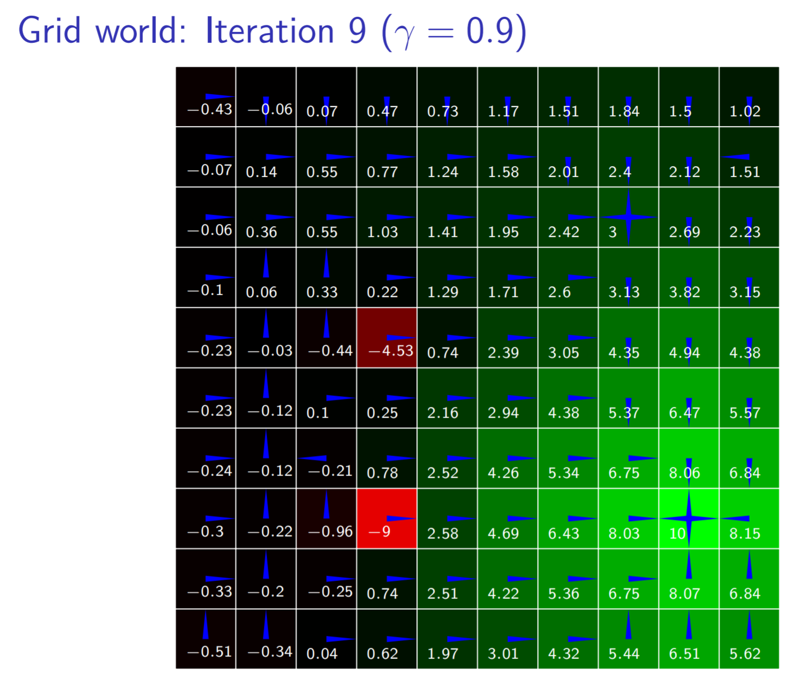
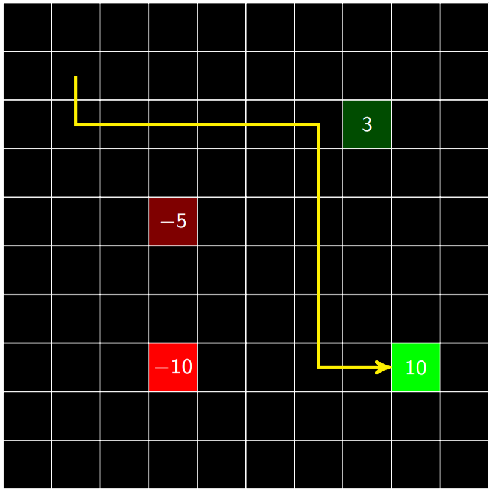

\usepackage{amsmath, amssymb}
\DeclareMathOperator*{\argmax}{arg\,max}
\DeclareMathOperator*{\argmin}{arg\,min}

## Introduction

We introduce *Bandit Problems* as a class of sequential optimization problems which require algorithmic techniques to study and structure solutions. 

- Standard dynamic proogram concerns sequential decision making problems where the transition model and reward function were known

- In many problems, the model and reward are  not known  in advance

- Agent must  learn how to act through experience  with the world

- Here we consider  reinforcement learning  where an agent receives a reinforcement signal

### Definition of intelligence

>Of a device or machine: able to vary its behaviour in response to differing requirements, varying situations, or past events

---Oxford English Dictionary

## Challenges in reinforcement learning}

- **Exploration** of the world must be balanced with **exploitation** of knowledge gained through experience

- Reward may be received long after the important choices have been made, so  credit must be assigned to earlier decisions 

- Must  generalize  from limited experience

## Outline

- Evaluative feedback

- Model-based methods

- Model-free methods

- Generalization

## Markov Decision Problems

- Agent chooses action $A_t$ at time $t$ based on observing state $S_t$

-  State evolves probabilistically based on current state and action taken by agent ( Markov assumption 
)

- Objective is to maximize sum of rewards $R_1, \ldots$

- Problem is known as a *Markov decision process* (MDPs)

- Defined by *transition model* $T(s' \mid s, a)$ and *reward model* $R(s, a)$ (often assumed deterministic)

## Optimal Behavior

- In the *finite-horizon model* agent should optimize expected reward for the next $H$ steps: $E(\sum_{t = 0}^H r_t)$

- In the *infinite-horizon discounted model* agent should optimize $E(\sum_{t = 0}^\infty \gamma^t r_t)$ 

- *Discount factor* $0 \leq \gamma < 1$ can be thought of as an interest rate (reward now is worth more than reward in the future)

- Discounting keeps utility of an infinite sequence finite

## Policies and utilities of states

- A *policy* $\pi$ specifies what action to execute from every possible state

- Action to execute from state $s$ according to $\pi$ is denoted $\pi(s)$

- Expected utility of executing $\pi$ when starting from $s$ is denoted $U^\pi(s)$

- Optimal policy $\pi^*$ is one that maximizes expected utility: $\pi^*(s) = \argmax_\pi U^\pi(s)$

## Iterative policy evaluation

- Incrementally compute expected utility after $k$ steps of executing $\pi$

- $U_0^\pi(s) = 0$

- $U_1^\pi(s) = R(s, \pi(s))$

-  ...

- $U_k^\pi(s) = R(s, \pi(s)) + \gamma \sum_{s'} T(s' \mid s, \pi(s)) U_{k-1}^\pi(s')$

This kind of iterative calculation is called **dynamic programming**

## Policy evaluation

- For an infinite horizon, $$U^\pi(s) = R(s, \pi(s)) + \gamma \sum_{s'} T(s' \mid s, \pi(s)) U^\pi(s')$$

- Can compute this arbitrarily well with enough iterations of iterative policy evaluation

- Alternative is to just solve system of $N$ linear equations, where $N$ is the number of states, requiring $O(n^3)$ time

-  $U^\pi = R^\pi + \gamma T^\pi U^\pi$ (in matrix form)

-  $U^\pi - \gamma T^\pi U^\pi = R^\pi$

-  $(I - \gamma T^\pi) U^\pi = R^\pi$

- $U^\pi = (I - \gamma T^\pi)^{-1}R^\pi$ 

## Policy iteration

- Policy iteration is one way to compute an optimal policy $\pi^*$

- The algorithm starts with any policy $\pi_0$ and iterates the following steps

*Policy evaluation*: given $\pi_i$ compute $U^{\pi_i}$

 

*Policy improvement*: compute new policy from $U^{\pi_i}$ $$\pi_{i+1}(s) = \argmax_a [ R(s, a) + \gamma \sum_{s'} T(s' \mid s, a) U^{\pi_i}(s')]$$

- Algorithm terminates when there is no more improvement

- Since every step leads to improvement and there are finitely many policies, algorithm terminates at optimal solution

# Value iteration

- An alternative algorithm is *value iteration*

- **Bellman equation** says value of optimal policy is given by $$U^*(s) = \max_a [R(s, a) + \gamma \sum_{s'} T(s' \mid s, a) U^*(s')]$$

- $U^*_0(s) = 0$ (initialization)

- $U^*_1(s) = \max_a [R(s, a) + \gamma \sum_{s'} T(s' \mid s, a) U_0^*(s')]$

- ...

- $U^*_k(s) = \max_a [R(s, a) + \gamma \sum_{s'} T(s' \mid s, a) U_{k-1}^*(s')]$

- $U^*_k \rightarrow U^*$ as $k \rightarrow \infty$

- $\pi(s) = \argmax_a [R(s, a) + \gamma \sum_{s'} T(s' \mid s, a) U(s')]$

## Convergence of value iteration

- Let $||U||$ denote the \alert<1>{max norm}, i.e. $||U|| = \max_s |U(s)|$

- $||U^*_k - U^*_{k-1}||$ is known as the \alert<2>{Bellman residual}

- Can be proven that if $||U^*_k - U^*_{k-1}|| < \epsilon(1-\gamma)/\gamma$ then $||U^*_k - U^*|| < \epsilon$ 

- Hence, slower convergence for $\gamma$ closer to 1

- Can also bound **policy loss**: if $||U^*_k - U^*|| < \epsilon$ then $||U^{\pi_k} - U^*|| < 2\epsilon\gamma/(1-\gamma)$ 

## Example: Grid World

- **States**: cells in $10\times10$ grid

- **Actions**: up, down, left, and right

- **Transition model**: 0.7 chance of moving in intended direction, uniform in other directions

- **Reward**: two states have cost (and are not terminal),\\ two have reward (and are terminal), $-1$ for wall crash

## Multi-armed bandit problem}

- Multi-armed bandit problems illustrate challenge with  exploration and exploitation  in a single state environment

- There is a slot machine with $k$ arms

- Arm $i$ pays off 1 or 0 according to unknown parameter $\theta_i$

- No deposit to play, but limited to $h$ pulls

- Many variations on problem, applicable to allocation of clinical trials, adaptive network routing, etc.

## Bayesian estimation of payoff probability

- Beta distribution can represent posterior over the win probability $\theta_i$ for arm $i$

- Uniform prior distribution is given by $Beta(1,1)$

- Keep track of number of wins $w_i$ and number of losses $\ell_i$ for each arm $i$

- Posterior for $\theta_i$ is given by $Beta(w_i + 1, \ell_i + 1)$

## Bayesian estimation of payoff probability

Red arm has 1 win and 0 loss and blue arm has 4 wins and 1 loss

- Posterior probability of winning: $\rho_i = P(\text{win}_i \mid w_i, \ell_i) = \int_0^1 \theta Beta(w_i + 1, \ell_i + 1)(\theta)\,d\theta = \frac{w_i + 1}{w_i + \ell_i + 2}$

- $\rho_\text{red} = 2/3 = 0.67$ and $\rho_\text{blue} = 5/7 = 0.83$

- Maximum likelihood estimates: $\hat \theta_\text{red} = 1$ and $\hat \theta_\text{blue} = 0.8$ 

 *Should you pull the red arm or blue arm?* 

## Ad-hoc strategies

- **$\epsilon$-greedy**: Choose random arm with probability $\epsilon$, otherwise choose $\argmax_i \rho_i$

- **Softmax**: Choose arm $i$ with probability proportional to $e^{\lambda \rho_i}$ ($\lambda \geq 0$ is precision parameter)

- **Interval exploration**: Compute $\alpha\%$ confidence interval for $\theta_i$, choose arm with highest upper bound

## Dynamic programming approach

- Counts $w_1, \ell_1, \ldots, w_k, \ell_k$ represents a \alert<1>{belief state}, which summarize belief about payoffs

- Use dynamic programming to find optimal policy $\pi^*$ mapping belief states to actions (similar to MDP)

- Expected payoff after pulling $i$ and then acting optimally is denoted $Q^*(w_1, \ell_1, \ldots, w_k, \ell_k, i)$

- $U^*(w_1, \ell_1, \ldots, w_k, \ell_k) = \max_i Q^*(w_1, \ell_1, \ldots, w_k, \ell_k, i)$

- $\pi^*(w_1, \ell_1, \ldots, w_k, \ell_k) = \argmax_i Q^*(w_1, \ell_1, \ldots, w_k, \ell_k, i)$

## Computing optimal state-action utility}

\begin{align*}

&Q^*(w_1, \ell_1, \ldots, w_k, \ell_k, i) = \\
&\frac{w_i + 1}{w_i + \ell_i + 2}U^*(\ldots, w_i + 1, \ell_i, \ldots) + \\ 
&\left(1 - \frac{w_i + 1}{w_i + \ell_i + 2}\right)U^*(\ldots, w_i, \ell_i + 1, \ldots)
\end{align*}

- When $\sum_i (w_i + \ell_i) = h$ (i.e., no pulls left) then $U^*(w_1, \ell_1, \ldots, w_k, \ell_k) = 0$

- Solution is **optimal**, but computation is **exponential** in $h$

- *Gittins allocation index* method can be used to efficiently solve infinite horizon, discounted version

Optimal exploration/exploitation difficult in multistate problems

## Translating to a Learning Problem

- Rather than *compute* the optimal policy, treat the policy and the underlying value function as primitives to be learned

- In the multi-arm bandit problem we have an on-line learning problem - we learn from data collected via exploration of the problem space, e.g., the agent's behavior constructs the data. 

- Use exploratory strategies (see above) but applied to the Bellman equation

- This is so called *reinforcement learning* - these aim to learn the optimal policy directly without use of a model of $T$ and $R$

## Incrementally Learning a Mean 

- Suppose we have a random variable $X$ and we want to estimate the mean from samples $x_1, \ldots, x_k$

- After $k$ samples $\hat x_k = \frac1k \sum_{i=1}^k x_i$

- Can show that $\hat x_k = \hat x_{k-1} + \frac1k (x_k - \hat x_{k - 1})$

- Can be written $\hat x_k  = \hat x_{k-1} + \alpha(k) (x_k - \hat x_{k - 1})$

- Learning rate $\alpha(k)$ can be functions other than $\frac1k$, loose conditions on learning rate to ensure convergence to mean

- If learning rate is constant, weight of older samples decay exponentially at the rate $(1 - \alpha)$

**Update rule: $\hat x  \leftarrow \hat x + \alpha(x - \hat x)$**

## Q-learning

- One algorithm is called **Q-learning**

- Idea is to apply *incremental estimation* to $Q(s, a) = R(s, a) + \gamma \sum_{s'} T(s' \mid s, a) \max_{a'} Q(s', a')$

- Interpretation of the Q-function: Choose action $a$ and act optimally thereafter. 

- Use sample of next state $s'$ and reward $r$ instead of models

- Q-learning rule: $Q(s, a) \leftarrow Q(s, a) + \alpha(r + \gamma \max_{a'} Q(s', a') - Q(s, a))$ 
    - Recall: $\hat x  \leftarrow \hat x + \alpha(x - \hat x)$

## Q-learning

- Q-learning will converge to the optimal policy

- However, Q-learning typically requires \alert<2>{a lot of experience}

- Utility is updated one step at a time

- **Eligibility traces** allow states along a path to be updated

## Functional Learning and Generalization

-  Up to this point, we've assumed $Q$ can be represented as a table, which is only useful for small discrete problems

- Problem with larger state spaces is *not just the size* of $Q$ table, but the *amount of experience* required to accurately estimate the values

- Agent must  generalize  from limited experience to states that have not yet been visited

## Functional Approximations

- Many generalization approaches attempt to approximate $Q$ with a function $Q_{\theta}(a,s)

- One way is to use a **perceptron**, one for each action

- Weights associated with edges

- $q = w_1 x_1 + w_2 x_2 + w_3 x_3$

- Given weights in perceptrons, compute $Q$ for each action from current state $\vec x$

## Perceptron Q-learning

- Q-learning tells us how to adapt the weights after transitioning to $\vec{x}'$ from $\vec{x}$ by action $a$ and receiving $r$

- $q' \leftarrow r + \gamma \max_{a'} Q(\vec{x}', a')$

- Compute error: $Q(\vec{x}, a) - q'$

- Update weights in perceptron for $a$ to reduce error using some learning rate

## Neural networks (aka Deep RL)

- **Neural networks** are networks of perceptrons

- Organized into input layer, hidden layer, and output layer

- Perceptrons only represent linear functions, but neural networks represent **non-linear** functions

- Q-learning works the same way as with perceptrons, though the adjustment of weights is tied to the backpropogation algorithms for fitting neural nets. 

## Other generalization approaches

- Locally weighted regression

- Self-organizing maps

- Decision trees

- Growing neural gas

- Support vector machines

- Gaussian processes

- Tile coding

- Radial basis function networks

Many ideas based on supervised and unsupervised methods

## Policy Function Approximation

- Rather than functionally approximate the Q function $Q_{\theta}(a,s)$ and then derive a policy $\pi_{\theta}$ from it, it is more efficient to approximate the policy function directly $\pi_{\theta}$ and apply gradient ascent to the policy parameters $\theta$. 

- We need an ability to *simulate* a Markov Chain of $(s_t,a_t)$ from $s_0$ given a policy $\pi_{\theta}$ to approximate the Bellman. 

- See the 

