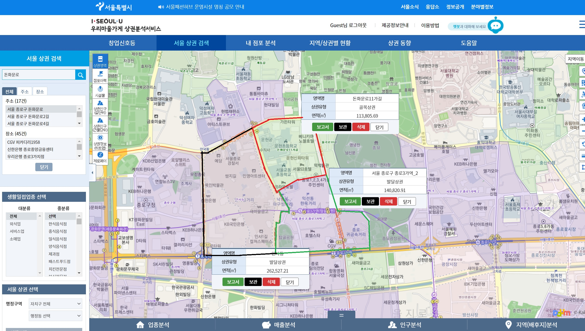

```{r setup, include=FALSE}
knitr::opts_chunk$set(echo = TRUE)
```

## Question of interest

First, We want to estimate demand for retail stores. What factors are most important for sales of retail stores? How is this different for different types of stores?

After estimating demands, we want to focus on predicting prosperity of business district. Does a business district will prosper or collapse? why? what factors are the most important to estimate long-term success of a business district? How can we predict the success of newly developed business district?

## Data

```{r pressure, echo=FALSE, fig.cap="example of a business district", out.width = '50%'}

 

```

https://golmok.seoul.go.kr/fixedAreaAnalysis.do

This is retail sales data of business districts in Seoul. Each observation represents the total sales of a specific category in a specific commercial district on a quarterly basis. In the picture above, I picked 3 business district as examples. The area is 113,805, 140,820, 262,527 squared meters. We can see that thea area is quite small.


In estimates_sales_year files, there are sales, number of transactions, percentage and amount of sales on weekdays and weekends and each day of the week, percentage and amount of sales generated in each time slot(00-06, 06-11, 11-14, 14-17, 17-21, 21-24), percentage and amount of sales generated by men, women and age groups, and number of transaction classified according to the above creteria, and number of stores.

Also, for other datasets, there are related variables like worker population(by age groups and sex), worker population for hinterland, floating population by sex, age, day of the week, and time slot, average operating month of a district and operated month for closed stores, number of nearby apartment complex and apartments classified by squared meters and price groups, average income and expenditure by sectors for hinterland dwellers.  


# import the data
```{r data,echo=FALSE}
# echo = FALSE : not show the data

# web version. takes too long, so I will work locally and update.
dropbox = FALSE
if (dropbox){
  estimated_sales_2020 <- read.csv("https://www.dropbox.com/s/kiysg9cnw8kokbo/estimated_sales_2020.csv?dl=1")
  
  Businessdistrict_apartment <- read.csv("https://www.dropbox.com/s/se6bx5vr2e0tl8o/Businessdistrict_apartment.csv?dl=1")
  
  
  Businessdistrict_changeindex <- read.csv("https://www.dropbox.com/s/zj7ad65s7pkqhyr/Businessdistrict_changeindex.csv?dl=1")
  
  
  Businessdistrict_estimated_floatingpopulation <- read.csv("https://www.dropbox.com/s/nxjv2b4ykxjxyj4/Businessdistrict_estimated_floatingpopulation.csv?dl=1")
  
  
  Businessdistrict_stores_2020 <- read.csv("https://www.dropbox.com/s/427xehbn74g18af/Businessdistrict_stores_2020.csv?dl=1")
  
  Businessdistrict_worker_population <- read.csv("https://www.dropbox.com/s/xu3xja4gxde1u52/Businessdistrict_worker_population.csv?dl=1")
  
  
  Hinterland_income_consumption <- read.csv("https://www.dropbox.com/s/gnzpjt9lvcv09tx/Hinterland_income_consumption.csv?dl=1")
  
  
  Hinterland_worker_population <- read.csv("https://www.dropbox.com/s/pfmh4i6tea5onci/Hinterland_worker_population.csv?dl=1")
}

# codes for local work.
if (!dropbox){
  estimated_sales_2020 <- read.csv("C:/Users/Administrator/Desktop/2021 Spring/Nonpara and ML/estimated_sales_2020.csv")
  
  Businessdistrict_apartment <- read.csv("C:/Users/Administrator/Desktop/2021 Spring/Nonpara and ML/Businessdistrict_apartment.csv")
  
  Businessdistrict_changeindex <- read.csv("C:/Users/Administrator/Desktop/2021 Spring/Nonpara and ML/Businessdistrict_changeindex.csv")
  
  Businessdistrict_estimated_floatingpopulation <- read.csv("C:/Users/Administrator/Desktop/2021 Spring/Nonpara and ML/Businessdistrict_estimated_floatingpopulation.csv")
  
  Businessdistrict_stores_2020 <- read.csv("C:/Users/Administrator/Desktop/2021 Spring/Nonpara and ML/Businessdistrict_stores_2020.csv")
  
  Businessdistrict_worker_population <- read.csv("C:/Users/Administrator/Desktop/2021 Spring/Nonpara and ML/Businessdistrict_worker_population.csv")
  
  Hinterland_income_consumption <- read.csv("C:/Users/Administrator/Desktop/2021 Spring/Nonpara and ML/Hinterland_income_consumption.csv")
  
  Hinterland_worker_population <- read.csv("C:/Users/Administrator/Desktop/2021 Spring/Nonpara and ML/Hinterland_worker_population.csv")
}
 
merge_data <- merge(estimated_sales_2020,Businessdistrict_apartment,by=c("year","quarter","bd_class_code","bd_class_codename","district_code","district_name"))
merge_data <- merge(merge_data,Businessdistrict_changeindex,by=c("year","quarter","bd_class_code","bd_class_codename","district_code","district_name"))
merge_data <- merge(merge_data,Businessdistrict_worker_population,by=c("year","quarter","bd_class_code","bd_class_codename","district_code","district_name"))
merge_data <- merge(merge_data,Hinterland_income_consumption,by=c("year","quarter","bd_class_code","bd_class_codename","district_code","district_name"))
merge_data <- merge(merge_data,Hinterland_worker_population,by=c("year","quarter","bd_class_code","bd_class_codename","district_code","district_name"))
merge_data <- merge(merge_data,Businessdistrict_estimated_floatingpopulation,by=c("year","quarter","bd_class_code","bd_class_codename","district_code","district_name"))


# data without sales_amount, to get rid of multicolinearity

ML_test_data <- merge_data[,append(c(1:33), 80:681)]
merge_test <- ML_test_data
```

```{r summary_data,echo=FALSE}

library(rmarkdown)
library(tidyverse)

df_summ<- merge_test %>%
  group_by(category_name) %>% 
  summarize(`Observations`=n(),`average_sales`=mean(sales),
            `average_number_transactions`=mean(number_of_transactions),
            `sales_weekday_ratio`=mean(sales_weekday_ratio),
            `sales_weekend_ratio`=mean(sales_weekend_ratio),
            `sales_monday_ratio`=mean(sales_monday_ratio),
            `sales_tuesday_ratio`=mean(sales_tuesday_ratio),
            `sales_wednesday_ratio`=mean(sales_wednesday_ratio),
            `sales_thursday_ratio`=mean(sales_thursday_ratio),
            `sales_friday_ratio`=mean(sales_friday_ratio),
            `sales_saturday_ratio`=mean(sales_saturday_ratio),
            `sales_sunday_ratio`=mean(sales_sunday_ratio),
            `time_00.06_sales_ratio`=mean(time_00.06_sales_ratio),
            `time_06.11_sales_ratio`=mean(time_06.11_sales_ratio),
            `time_11.14_sales_ratio`=mean(time_11.14_sales_ratio),
            `time_14.17_sales_ratio`=mean(time_14.17_sales_ratio),
            `time_17.21_sales_ratio`=mean(time_17.21_sales_ratio),
            `time_21.24_sales_ratio`=mean(time_21.24_sales_ratio),
            `male_sales_ratio`=mean(male_sales_ratio),`female_sales_ratio`=mean(female_sales_ratio),
            `age10_sales_ratio`=mean(age10_sales_ratio),
            `age20_sales_ratio`=mean(age20_sales_ratio),
            `age30_sales_ratio`=mean(age30_sales_ratio),
            `age40_sales_ratio`=mean(age40_sales_ratio),
            `age50_sales_ratio`=mean(age50_sales_ratio),
            `ageover60_sales_ratio`=mean(ageover60_sales_ratio)
            )

paged_table(df_summ)
```

## Including Plots

```{r plot_for_data}
library(dplyr)

# number of stores in one business district.
summary_data <- estimated_sales_2020 %>%
  group_by(year,quarter,district_code) %>% 
  summarise(sum = sum(number_of_stores),
            n = n())

summary_data

hist(summary_data$sum,breaks=1000,xlim =c(0,2000),main="Number of stores in a business district")
```

As we can see, \textbf{the business district usually consists of 0~100 stores}. As we have seen in the picture, the area is quite small. 

```{r plot_for_data2}
# number of stores in one business district, by category
summary_data2 <- estimated_sales_2020 %>%
  group_by(year,quarter,district_code,category_code) %>% 
  summarise(sum = sum(number_of_stores),
            n = n())
summary_data2
hist(summary_data2$sum,breaks=20000,xlim =c(0,100),main="Number of stores in a certain category")
```

This is a plot for number of stores in a certain category in one business district.


```{r tree}
library(rsample)
library(dplyr)
library(rpart)
library(rpart.plot)

set.seed(123)
ames_split <- initial_split(merge_test, prop = .7)
ames_train <- training(ames_split)
ames_test  <- testing(ames_split)

# grid for tuning parameters
hyper_grid <- expand.grid(
  minsplit = seq(5,20,1),
  maxdepth = seq(8,15,1)
)

head(hyper_grid)

models <- list()

for (i in 1:nrow(hyper_grid)) {
  
  # get minsplit, maxdepth values at row i
  minsplit <- hyper_grid$minsplit[i]
  maxdepth <- hyper_grid$maxdepth[i]
  
  # train a model and store in the list
  # print("minsplit, maxdepth is")
  # print(minsplit)
  # print(maxdepth)
  models[[i]] <- rpart(
    formula = sales ~ .,
    data    = ames_train,
    method  = "anova",
    control = list(minsplit = minsplit, maxdepth = maxdepth)
  )
}

# function to get optimal cp
get_cp <- function(x) {
  min    <- which.min(x$cptable[, "xerror"])
  cp <- x$cptable[min, "CP"] 
}

# function to get minimum error
get_min_error <- function(x) {
  min    <- which.min(x$cptable[, "xerror"])
  xerror <- x$cptable[min, "xerror"] 
}

hyper_grid %>%
  mutate(
    cp    = purrr::map_dbl(models, get_cp),
    error = purrr::map_dbl(models, get_min_error)
  ) %>%
  arrange(error) %>%
  top_n(-5, wt = error)

optimal_tree <- rpart(
  formula = sales ~ .,
  data    = ames_train,
  method  = "anova",
  control = list(minsplit = 10, maxdepth = 8, cp = 0.01)
)

pred <- predict(optimal_tree, newdata = ames_test)
p_error <- Metrics::rmse(actual = ames_test$sales, predicted = pred)
p_error


rpart.plot(optimal_tree,cex=0.5)

```

The above plot is a result for tree method. It doesn't seem to have predictive power. I think I have to estimate demands for each category. 

## Random Forest Method

Now, proceed to the RF method.

```{r Random Forest}
# Helper packages
library(dplyr)    # for data wrangling
library(ggplot2)  # for awesome graphics

# Modeling packages
library(ranger)   # a c++ implementation of random forest 
library(h2o)      # a java-based implementation of random forest


# create Ames training data
set.seed(123)
ames <- merge_test
split  <- initial_split(ames, prop = 0.7, strata = "sales")
ames_train  <- training(split)

# number of features
n_features <- length(setdiff(names(ames_train), "sales"))

# train a default random forest model
ames_rf1 <- ranger(
  sales ~ ., 
  data = ames_train[complete.cases(ames_train),],
  mtry = floor(n_features / 3),
  respect.unordered.factors = "order",
  seed = 123
)

# get OOB RMSE
(default_rmse <- sqrt(ames_rf1$prediction.error))

# create hyperparameter grid
hyper_grid <- expand.grid(
  mtry = floor(n_features * c(.05, .15, .25, .333, .4)),
  min.node.size = c(1, 3, 5, 10), 
  replace = c(TRUE, FALSE),                               
  sample.fraction = c(.5, .63, .8),                       
  rmse = NA                                               
)

# execute full cartesian grid search
for(i in seq_len(nrow(hyper_grid))) {
  # fit model for ith hyperparameter combination
  fit <- ranger(
    formula         = sales ~ ., 
    data            = ames_train[complete.cases(ames_train),], 
    num.trees       = n_features * 10,
    mtry            = hyper_grid$mtry[i],
    min.node.size   = hyper_grid$min.node.size[i],
    replace         = hyper_grid$replace[i],
    sample.fraction = hyper_grid$sample.fraction[i],
    verbose         = FALSE,
    seed            = 123,
    respect.unordered.factors = 'order',
  )
  # export OOB error 
  hyper_grid$rmse[i] <- sqrt(fit$prediction.error)
}

# assess top 10 models
hyper_grid %>%
  arrange(rmse) %>%
  mutate(perc_gain = (default_rmse - rmse) / default_rmse * 100) %>%
  head(10)

# re-run model with impurity-based variable importance
rf_impurity <- ranger(
  formula = sales ~ ., 
  data = ames_train[complete.cases(ames_train),], 
  num.trees = 2000,
  mtry = 32,
  min.node.size = 1,
  sample.fraction = .80,
  replace = FALSE,
  importance = "impurity",
  respect.unordered.factors = "order",
  verbose = FALSE,
  seed  = 123
)

# re-run model with permutation-based variable importance
rf_permutation <- ranger(
  formula = sales ~ ., 
  data = ames_train[complete.cases(ames_train),], 
  num.trees = 2000,
  mtry = 32,
  min.node.size = 1,
  sample.fraction = .80,
  replace = FALSE,
  importance = "permutation",
  respect.unordered.factors = "order",
  verbose = FALSE,
  seed  = 123
)
p1 <- vip::vip(rf_impurity, num_features = 25, bar = FALSE)
p2 <- vip::vip(rf_permutation, num_features = 25, bar = FALSE)

gridExtra::grid.arrange(p1, p2, nrow = 1)
```

The result tells us that number of transactions are the most important, and number of stores also. 

## Things to proceed


we have to do with t-1 data for sales_ratio or sales_amount.


