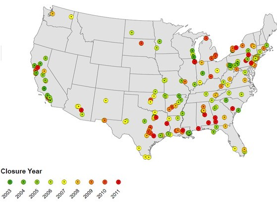

```{r setup, include=FALSE}
knitr::opts_chunk$set(echo = FALSE)
```

## Research question

Can we predict whether a hospital will exit from a market?

- More specifically, predict whether it will shut down, convert to a clinic, be acquired, or continue participating in a market. 

-	*Feature selection*: given many potentially relevant variables, which are most important for prediction? 

-	*Non-linearity*: is a hospital's underlying exit decision making process well captured by a non-linear model? 

```{r,echo=FALSE, fig.cap="Hospital closures, 2003-2011 (Source: Harvard School of Public Health)"}

```

## Motivation 

Hospital exit is an important policy issue in its own right (e.g., access to care in rural communities and during COVID). Another initial inspiration for this project was to try to empirically investigate revealed preference assumptions used in dynamic entry models. That is, a firm's exit reveals something about the structure of its underlying profit. However, to the extent that a firm's exit is a complex function of capital constraints and factors related and unrelated to profits, it may not reveal much about expected profitability.

We expect that ML techniques such as RF may be able to outperform regression methods. Intuitively, a hospital's actual decision making process may resemble a decision tree more than a linear function of expected profits. It's not hard to come up with hypothetical non-linearities for hospitals: 

- *Capital constraints and non-profit utility*: A non-profit hospital may prefer to stay open with low expected profits but be constrained in borrowing more to do so (Lakdawalla and Phillipson 2006). In contrast, public or for-profit hospitals may enjoy easier access to capital-- from donors and local governments, or parent systems and equity capital markets, respectively (Duggan 2000).

- *Multiple agents*: hospital systems and debtholders may make participation decisions on behalf of hospitals that are not expected utility maximizing (Stulz 1990).

- *Uncertainty*: risk averse managers may prefer a hospital’s scrap value, or alternate uses of capital, to uncertain future profits (Wedig et al. 1989).

## Preliminary algorithmic modeling plan

First, we plan to build and prune a classification tree using the CART algorithm. Our first ~7 years of data can be used as the training set, and the last ~3 years as a test set. Next, we plan to grow a random forest, tuning the number of variables considered at each split as needed. We will attempt to interpret the models using variable importance plots, e.g., based on the Gini splitting index. We also plan to try bagging and boosting trees. 

Why RF? 

-	We have high dimensional data, so we plan to rely on RF for variable selection.

-	RF is hard to overfit, provides good predictive performance and some interpretability.

-	RF predicts relatively better when the underlying process is highly nonlinear, e.g., in the context of uncertainty and frictions (Coulombe et al. 2020).

It may be informative to compare the performance of RF against multinomial logit or linear methods for classification and try to assess how important nonlinearity is. If we are lucky, inspection of the pruned tree, variable importance plots, and the first weak learner variables may give us a sense of whether capital constraints, debt and system ownership, or opportunity costs of capital predict exit, and what factors specifically differentiate closures from conversions and acquisitions.

## Data 

```{r}
library(haven)
library(skimr)
hcris <- read_dta("gandhi_hcris.dta")
```

We are still adding variables to our data, but here are some preliminary descriptive statistics. 
The key outcome variable is a hospital's market participation decision in each year:

```{r}
library(gmodels)
CrossTable(hcris$outcome)
```

We observe ~6,300 hospitals over 2008-2017 (or as early as 1996, with some more work).

Our explanatory variables include hospital characteristics (e.g., non-profit, rural, # of beds) and financial data, along with market demand and competition factors. We have ~80 explanatory variables (~33 of which are categorical; the remainder are quantitative) before including lags.    

If we skim the data, it looks like this:

```{r,echo=TRUE}
skim(hcris)
```

Our data sources are: 

- Center for Medicare & Medicaid Services (CMS) Hospital Cost Report Information System (HCRIS): financial data for US providers (hospitals)

- American Hospital Association (AHA): hospital characteristics; tracks exits and ownership changes 

-	American Community Survey (ACS): market demographics

-	Other CMS data: average Medicare patient complexity, local wages, (possibly) other local providers


