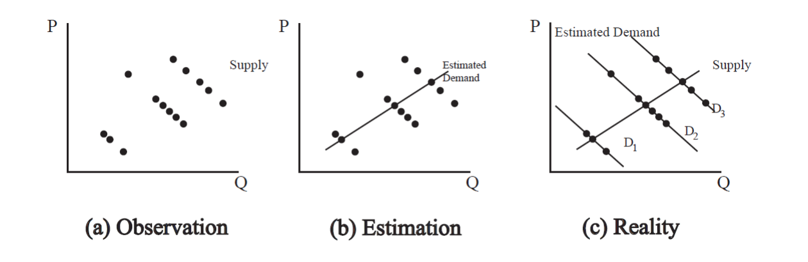

```{r setup, echo=FALSE,message=FALSE}
library(tidyverse)
df = read.csv("blp.csv")

df_summ<- df %>% group_by(market) %>% summarize(`Number of Models`=n(),`Horsepower/Weight`=mean(hpwt),`Space`=mean(space),`AC Dummy`=mean(air),`Miles per Dollar`=mean(mpd),`Miles per Gallon`=mean(mpg),`Price, Thousands of 1983 Dollars`=mean(price),`Quantity`=mean(quantity),`Produced in Japan`=mean(japan),`Produced in Europe`=mean(euro)) %>% ungroup

df_summ2<- as.data.frame(apply(df[,c(8:15,17:18)],2,summary))
names(df_summ2)<- c("Horsepower/Weight","Space","AC Dummy","Miles per Dollar","Price","Miles per Gallon","Quantity","Market Share","Produced in Japan","Produced in Europe")
```

### Introduction

```{r,echo=FALSE}

```

Demand estimation is a central problem in applied economics, and one to which considerable econometric effort has been dedicated. Indeed, it is one of the most common examples of simultaneity bias, leading to the widespread use of instrumental variables techniques to overcome this issue. Discrete choice techniques, on the other hand, attempt to avoid this issue entirely by looking at the behavior of individual consumers, who face an essentially flat supply curve assuming no buyer-side market power.

@blp_1995 introduced a new method to estimate demand in differentiated products markets using this type of discrete choice method, but on a relatively aggregated dataset. It was remarkable for a number of reasons, not least for its use of discrete choice techniques on a dataset which contained no data at the individual consumer level. Their structural approach became quite popular for its usefulness in a wide variety of IO settings, but it came at the cost of considerable computational effort and relatively restrictive functional form assumptions.

On the other hand, relatively little attention has been dedicated to solving the demand estimation problem from an algorithmic modeling standpoint. But how could machine learning and algorithmic modeling help with a problem so centered around inference, resolving endogeneity problems, and estimating structural parameters? At first glance, it isn't quite clear. However, we believe algorithmic modeling does in fact have a place in this data-model-dominated setting, mainly because of counterfactual prediction. 

The implicit goal of estimating the price coefficient in a demand equation is to be able to predict what demand would be if the price were changed in some counterfactual. But this idea isn't so far removed from the idea of out-of-sample performance for a predictive algorithm. Perhaps training algorithmic models with good out-of-sample performance like random forests or boosting could provide strong results for this counterfactual prediction problem. While they might not be able to directly estimate structural parameters, we might be able to compare their predictions on a test set or some other counterfactual data to the predictions of more traditional demand estimation models. Such comparisons could allow us to make inferences about the behavior of these algorithmic models, and perhaps even estimate implied elasticities.

### Research Questions

In this project, we will attempt to answer the following questions:

1. How does the out-of-sample performance of algorithmic models compare with their structural counterparts in the demand estimation problem?

2. How can we compare the economic significance of the outputs from the algorithic models with those of structural models?

### Data

We will be working with the dataset of @blp_1995. It is a panel data set of car models containing their yearly sales quantities and product characteristics such as prices, miles per gallon etc. In total, there are 2000+ observations with 10 variables, observed over 20 years. Out of the 10, 3 variables are binary, with the remaining 7 being continuous. The dataset also contains identifiers for the year of the observation, the producing firm, and the model name and year. Prices are in thousands of 1983 dollars, so no inflation adjustment is required.

Below we provide a summary table of mean values for each variable during the first 10 years of the panel. 

```{r, layout="l-body-outset",echo=FALSE}
library(rmarkdown)
paged_table(df_summ)
```

Overall, we see an upward trend in the real list price of automobiles during the sample period. Space shows a decreasing trend, reflecting observable market trends towards smaller vehicles post-1970. 

Here is a summary table showing the ranges of observations for variables over all years:

```{r, layout="l-body-outset",echo=FALSE}
paged_table(df_summ2)
```

Characteristics and prices generally show significant variability throughout the dataset. This assists with the identification of the BLP model, and we would hope it will also increase predictive accuracy for the algorithmic models we will use. 

In addition to this dataset, we also have access to demographic data, which contains the mean of log income for each year, and the standard deviation of log income across all years. 

### Proposed Methods

To answer question 1, we will take a straightforward approach: compare the out-of-sample predictive performance of several algorithmic models and various versions of the BLP model. Specifically, we will be predicting market shares from price and product characteristics. We will estimate the models on a random portion of the dataset, and then evaluate them on the remaining test set. 

Methods we may use on the algorithmic side include:

- CART
- Bagging
- Boosting
- Random Forest

Methods we may use on the structural side include:

- OLS Logit
- IV Logit
- Random Coefficients Logit

Question 2 may require a more creative approach. Some algorithmic models, like CART, are fairly interpretable, and we may be able to compare their results with those of structural models. Others, like random forest, may not be so interpretable. A first approach will be to use variable importance plots to get an idea of what's happening inside the algorithmic black box, and compare these results to those of the structural models. 

Another, more ambitious, approach is to look for specific automobile models which appear multiple times in the dataset with different prices. Train the models on some observations and then predict the market shares after a price change. We would then scale these predicted demand changes appropriately to compare with the estimated BLP own-price elasticities. We're not sure yet whether such a comparison is possible or valid, but it is something we would like to examine. 
