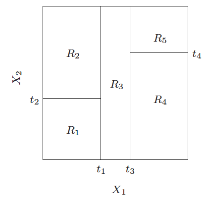
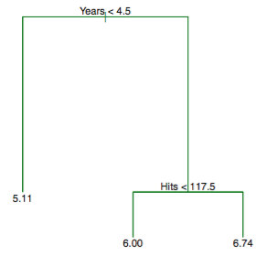
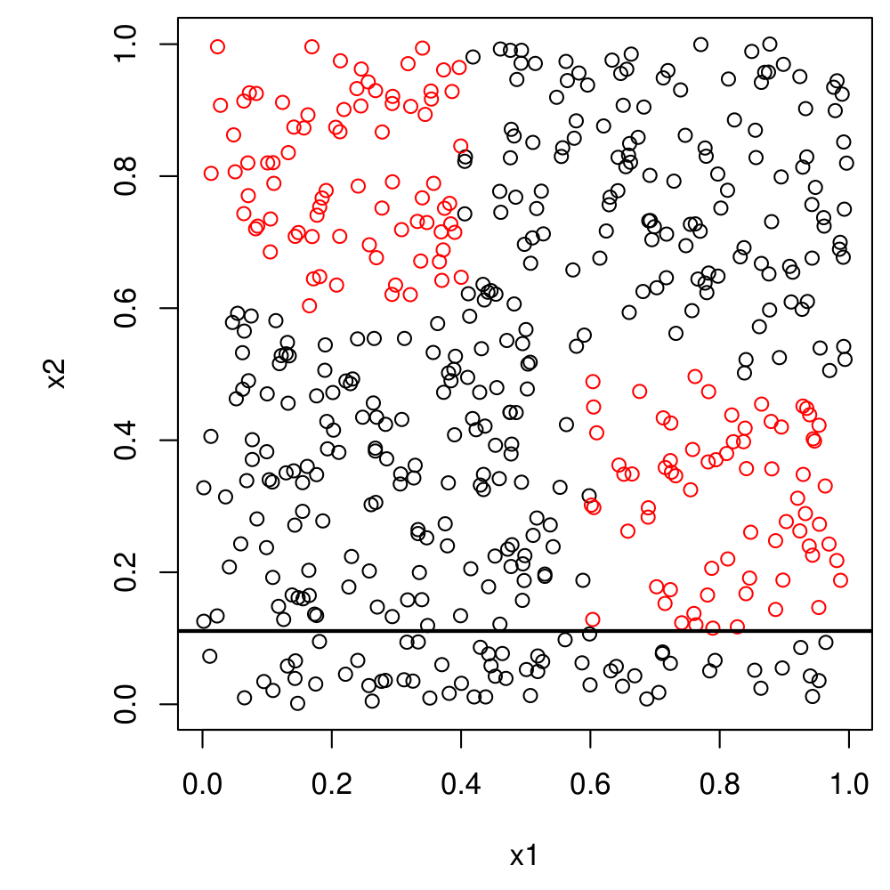

```{r setup, include=FALSE}
knitr::opts_chunk$set(echo = FALSE)

# Learn more about creating blogs with Distill at:
# https://rstudio.github.io/distill/blog.html

```

\newcommand{\argmax}{\mathop{\mathrm{argmax}}}
\newcommand{\argmin}{\mathop{\mathrm{argmin}}}
\def\P{\mathrm{P}}
\def\R{\mathbb{R}} 

Algorithmic models begin with an ``expressive space'' for representing the non-parametric primitive of interest (see previous post for the 3 main classes of non-parametric primitives). In the case of supervised learning, we seek a space to represent the conditional mean of $Y$ given $X$, which is the theoretically optimal predictor of $Y$ from $X$ under squared error loss 

The algorithms themselves are concerned with finding a particular representation in the expressive space to fit the data at hand. The behavior of the algorithm for conducting this search is governed by a set of **tuning parameters** $\eta$. The process of finding the **optimal tuning** parameters is called (rather simply) *tuning*,


## Decision Trees

- The general idea of prediction/decision trees is that we will partition the predictor space into a number of simple, rectangular regions. 

- In order to make a prediction for a given observation, we typically use the mean of the training data in the region to which it belongs. 

- Rectangles can be achieved by making successive binary splits on the predictors variables $X_1,\ldots X_p$. i.e.,
we choose a variable $X_j$, $j=1,\ldots p$, and <font color = "red"> divide </font> up the 
feature space according to 
$$X_j \leq c \;\;\;\text{and}\;\;\; X_j > c$$ 
Then we proceed
on each half


- The splitting rules can be summarized visually as a tree,  these approaches are called *decision tree* methods. 

<center>
**Constructing a partitioned space from a decision tree**
</center>

```{r, out.width=c('50%', '50%'), fig.show='hold'}
knitr::include_graphics("images/ex1-tree.png")

```


- These methods are both simple and useful for interpretation. 

- Note however that not every partition of the predictor space can be represented as a tree

```{r, out.width = '75%'}
knitr::include_graphics("images/ex1-notpos.png")
```

## How to use trees?

- For an observation falling in region $R_{j}$, we predict a value for the the outcome $Y$ as $c_{j}$
- The estimated regression function has the form
$$\hat{f}^\mathrm{tree}(x) \;=\; \sum_{j=1}^m c_j \cdot 1\{x \in R_j\}
\;=\; c_j \;\, \mathrm{such}\;\mathrm{that}\;\, x \in R_j$$

- In the case of a regression problem, the $c_j$ are real numbers. 
How would we choose these? Simple: just take the average response of all of the
points in the region. Note that each region $R_j$ contains some subset of the training data
$(x_i,y_i)$, $i=1,\ldots n$, say, $n_j$ points. Thus
$$c_j = \frac{1}{n_j} \sum_{x_i \in R_j} y_i$$ 

- In the case of a classification problem, the prediction is a class $c_{j} \in \{1,\dots,K\}$ The predicted class $c_j$ is 
just most common occuring class among these points. 

- In particular, for each class
$k=1,\ldots K$, we can estimate the probability that the class label is $k$
given that the feature vector lies in region $R_j$, $\P(C=k|X\in R_j)$, by
$$\hat{p}_k (R_j) = \frac{1}{n_j}\sum_{x_i \in R_j} 1\{y_i = k\}$$
the <font color = "red">  proportion of points  </font> in the region that are of class $k$. 

- We can now express the predicted class as
$$c_j = \argmax_{k=1,\ldots K} \; \hat{p}_k (R_j)$$


### Prediction of baseball player's salary

- Suppose we wish predict a baseball player’s Salary based on Years (the number of years that he has played in the major leagues) and Hits (the number of hits that he made in the previous year). 


- Salary is measured in thousands of dollars.

<font color = "red"> Prediction of baseball player's salary </font>

**Figure 1**

```{r, out.width="50%"}

```

The regression tree depicts the prediction of the log salary of a baseball player, based on the number of years that he has played in the major leagues and the number of hits that he made in the previous year. At a given internal node, the label (of the form $X_j < t_k$) indicates the left-hand branch resulting from that split, and the right-hand branch corresponds to $X_j \geq t_k.$

- The tree represents a series of splits starting at the top of the tree. 

- The top split assigns observations having $Years < 4.5$ to the left branch.

- The predicted salary for these players is given by the mean response value for the players in the data set with $Years < 4.5.$ 

- For such players, the mean log salary is 5.107, and so we make a prediction of $e^{5.107}$ thousands of dollars, i.e. $165,174$

Another way to see the result of the tree is through the rectangular partition of the predictor space. 

**Figure 2**

```{r, out.width="50%"}
knitr::include_graphics("reg-partition-hitters.png")
```

- We can write these regions as the following:

    1. $R_1 ={X \mid Years < 4.5}$
    2. $R_2 ={X \mid Years \geq 4.5,  Hits < 117.5}$
    3. $R_3 = {X \mid Years \geq 4.5,  Hits \geq 117.5}.$

- Notice the powerful appeal of **interpretability** of the resulting tree - even without a deep domain understanding of baseball, there is an intuitive sense that emerges for how baseball salaries work. 

### Terminology

- In keeping with the tree analogy, the regions $R_1$, $R_2$, ..., $R_{J}$ are known as **terminal nodes** or **leaves** of the tree. 

- The points along the tree where the predictor space is split are referred to as **internal nodes**.

- In Figure 1, the two internal nodes are indicated by the text $Years<4.5$ and $Hits<117.5.$

- We refer to the segments of the trees that connect the nodes as **branches**

## How to build trees?

- There are two main issues to consider in building a tree:
    1. How to choose the splits?
    2. How big to grow the tree?

- Think first about varying the depth of the tree ... 
    - Which is more complex - a big tree or a small tree? 
    - What <font color = "red"> tradeoff </font> is at play here? 
    - How might we eventually consider choosing the depth?

- Now for a fixed depth, consider choosing the splits. 
    -If the tree has depth $d$, then it has $\approx 2^d$ nodes. 
    - At each node we could choose any of $p$ the variables for the split
    - This means 
that the number of possibilities is
$$p \cdot 2^d$$
    - This is <font color = "red"> huge </font> even for moderate $d$! And we haven't even
counted the actual split points themselves

## The CART Algorithm


- The <font color = "red"> CART algorithm </font>^[Breiman et al. (1984), ``Classification
and Regression Trees'']
chooses the splits in a top down fashion: then chooses the first variable 
to at the root, then the variables at the second level, etc. 


- At each node $t$ encountered along the algorithm (starting with the root node), we have a measure of *node impurity* $Q_{t} = Q(D_{t})$, which is a function of the data set $D_{t}$ arriving at node $t$. Let $c_{t}$ be the predicted value for node $t$. 
    - For regression trees, a common impurity measure is the variance $$\frac{1}{N_{t}} \sum_{i=1}^{N_{t}} (y_{i,t} - \bar{y}_t)^{2}$$
    - For classification trees, a common impurity measure is the mis-classification rate $$1 - \hat{p}_{c_{t}}$$ where $c_{t}$ is the predicted class for node $t$. 
    - Alternatives to misclassification error for classification trees are the Gini index or cross-entropy. 
    
- At node $t$ we must determine the optimal split $(j,s)$ where $j$ indexes the predictor variable $X_{j}$ we split and $s$ the split point. Let $D_{left}$ and $D_{right}$ be the induced data sets going to the left and right nodes from the split $(j,s)$, with number of observations $N_{left}$ and $N_{right}$ respectively. 

- At each step of the CART algorithm we seek to maximize the *information gain* $IG$ of the split as measured by $$IG(D,j, s) = Q(D) - \frac{N_{left}}{N} Q(D_{left}) - \frac{N_{right}}{N} Q(D_{right})$$ where $D$ is the dataset of the parent node. 

- The CART algorithm greedily chooses the split to minimize $$N_{left} Q(D_{left}) + N_{right} Q(D_{right})$$


- Having done this, we now recursively repeat the process for each new node arising from the split, treating $D_{left}$ and $D_{right}$ as parent data sets. 


- How do we find the best split $s$? Aren't there <font color = "red"> infinitely many </font> to consider?
No, to split at node $t$ on a variable $j$, we really only need to consider $N_t$ 
splits (or $N_t-1$ splits)


```{r, fig.align='center'}

```

<br>

- When does the process stop? stopping We stop only when each terminal node has fewer than some minimum number of observations (e.g., 10 observations).


### Pruning the tree

- Continuing on in this manner, we will get a big tree $T_0$. Let the size $\tilde{T}_{0} = |T_{0}|$ be denoted by the number of leaf nodes.

- A natural concern with CART is overfitting - we have grown the tree to large.

- We then <font color = "red"> prune </font> this tree, meaning that we collapse some of its 
leaves into the parent nodes.


- Notice that the total information gain from building the tree is $$Q(D) - \sum_{t}^{T} \frac{N_{t}}{N}Q(D_t)$$ where $D$ is the data entering the root node (e.g., the full training sample)

- We seek to find the subtree $T \subset T_{0}$ to minimize the *cost complexity criterion* $$C_{\alpha}(T) = \sum_{t=1}^{|T|} N_{t}Q_t + \alpha |T|$$

- What is the logic of this approach? That is, why grow a large tree and prune, instead of just stopping at some point when the information gain ?
Because any stopping rule may be <font color = "red"> short-sighted </font>, in that a split
may look bad but it may lead to a good split below it.

```{r, fig.align='center'}

```

<br>

- For any given $\alpha$, the optimal pruned tree $T(\alpha)$ can be found via a convenient algorithm - *weakest link pruning*. 

- When $\alpha = 0,$ then the subtree T will simply equal $T_0$, because then the penalized objective just measures the training error.
- However, as  $\alpha = 0$ increases, there is a price to pay for having a tree with many terminal nodes, and so the penalized objective will be minimized for a smaller sub-tree. 

- We start from the full tree $T_{0}$

- For any internal node $t$,we let $T{t}$ be the branch of $T$ with root $t$ (e.g., the pruned part if we snip the tree at node $t$)

- The cost complexity criterion would become smaller by pruning at $t$ if the following held

$$ N_{t} Q(D_{t}) + \alpha  < \sum _{t^\prime = 1}^{|T_{t}|} N_{t^\prime}Q(D_{t^\prime}) + \alpha|T_{t}| $$

- It pays to prune at $t$ if $$\alpha > \frac{N_{t} Q(D_{t}) - \sum _{t^\prime = 1}^{|T_{t}|} N_{t^\prime}Q(D_{t^\prime})}{|T_{t}| - 1} = g_{0}(t)$$

- Observe that $\alpha$ is always positive because the numerator of the RHS is a re-scaled version of the information gain from splitting at $t$. 
this can be done by pruning the weakest leaf one at a time. 

- Define the weakest link in $T_{0}$ as the internal node $t_{0}$ such that $g_{0}(t_{0}) = \min g_{0}(t)$, and let $\alpha_{1} = g_{0}(t_{0})$

- Prune the tree $T_{0} - T_{1}$ and repeat the weakest link process. 

- This gives us a decreasing sequence of trees $$T_{0} \prec T_{1} \dots \prec t_{root}$$ all the way down to the root node $t_{root}$, as well as an increasing sequence of $\alpha$ values $$0 < \alpha_{1} < \alpha_{2} < \dots < \alpha_{K}$$

- A key result in Breiman et al (1984) is that for $\alpha$ such that $\alpha_{k} < \alpha < \alpha_{k+1}$, the optimum tree $T(\alpha)$ is $T_{k}$. 

- $\alpha$ is a <font color = "red"> tuning parameter </font>, and a larger $\alpha$ yields a smaller tree.

- Thus as $\alpha = 0$ increases from 0, branches are pruned from the tree in a nested and predictable way (resulting in the whole sequence of subtrees as a function of  $\alpha$).

- CART picks from the finite menu of potential $\alpha_{k}$ by 5- or 10-fold cross-validation


### Algorithm for Building a Regression Tree

1. Use recursive binary splitting to grow a large tree on the training data, stopping only when each terminal node has fewer than some minimum number of observations.
2. Apply cost complexity pruning to the large tree in order to obtain a sequence of best subtrees, as a function of $\alpha.$
3.  Use $K$-fold cross-validation to choose $\alpha.$ That is, divide the training observations into $K$ folds. For each $k = 1, \ldots, K$:

    - Repeat Steps 1 and 2 on all but the kth fold of the training data.
    - Evaluate the mean squared prediction error on the data in the
left-out kth fold, as a function of $\alpha.$ 
    - Average the results for each value of $\alpha$, and pick $\alpha$ to minimize the
average error.
4. Return the subtree from Step 2 that corresponds to the chosen value of $\alpha.$

### Some considerations

- Splitting a categorical variable predictor variable with many levels can be onerous, e.g., a categorical variable with $q$ levels has $2^{q-1} - 1$ potential splits, and thus need to carefully consider category definitions in using such predictors. 

## An Empirical Example: Spam Data

-In an empirical analysis, we will split our data $D$ into a test $D_{test}$ and training $D_{train}$ set. 

- We will run the CART algorithm (grow and prune a tree) on $D_{train}$ to extract a prediction tree, and perform predictions on the $D_{test}$

- Cross validation is usually done with 5 or 10 folds, and the "one standard error" rule is applied (the simplest model with performance at the min of the CV performance + one standard error)

- Example from ESL: $n=4601$ emails, of which 1813 are considered spam. For each email
we have $p=58$ attributes. The first 54 measure the frequencies of 54 key words
or characters (e.g., "free", "need", "$"). The last 3 measure
    - the average length of uninterrupted sequences of capitals;
    - the length of the longest uninterrupted sequence of capitals;
    - the sum of lengths of uninterrupted sequences of capitals

- Cross-validation error curve for the spam data (from ESL page 314):

```{r}
knitr::include_graphics("images/spamcv.png")
```

- The blue curve is the 10-fold cross validation estimate of the mis-classification rate with SE bars. The orange curve is the test error, which tracks the CV error closely. 

- The min occurs at a tree of size 17 (with one SE rule applied)

```{r}
knitr::include_graphics("images/spamtree.png")
```


## Running CART in R

The package `rpart` provides a fast implementation and interface for the CART algorithm and decision trees in R. We consider an example here with the Ames, Iowa Housing Data (sometimes called the *new iris* data). For a description, see [here](https://www.tmwr.org/ames.html)

We can first load the data

```{r, echo = TRUE}
library(rsample)     # data splitting 
library(dplyr)       # data wrangling
library(rpart)       # performing regression trees
library(rpart.plot)  # plotting regression trees
library(skimr)
```

Lets skim the data.

```{r}
skim(AmesHousing::make_ames())
```

Create training and test samples.

```{r, echo = TRUE}
# Create training (70%) and test (30%) sets for the AmesHousing::make_ames() data.
# Use set.seed for reproducibility

set.seed(123)
ames_split <- initial_split(AmesHousing::make_ames(), prop = .7)
ames_train <- training(ames_split)
ames_test  <- testing(ames_split)
```

Construct a tree on the training sample

```{r, echo = TRUE}
m1 <- rpart(
  formula = Sale_Price ~ .,
  data    = ames_train,
  method  = "anova"
  )

class(m1)
m1
```


Plot the fitted tree

```{r}
rpart.plot(m1)
```

Visualize the cross validation experiment

```{r, echo = TRUE}
plotcp(m1)
```

We can force a larger tree to be fit

```{r, echo = TRUE}

m2 <- rpart(
    formula = Sale_Price ~ .,
    data    = ames_train,
    method  = "anova", 
    control = list(cp = 0, xval = 10)
)

plotcp(m2)
```

The data underlying cross validation can be extracted

```{r, echo = TRUE}
m1$cptable
```

Now predict on the test set:

```{r, echo = TRUE}
pred <- predict(m1, newdata = ames_test)
p_error <- Metrics::rmse(actual = ames_test$Sale_Price, predicted = pred)
p_error
```

e.g.,the average distance between predicted values and actuals is `39,852` dollars. 
