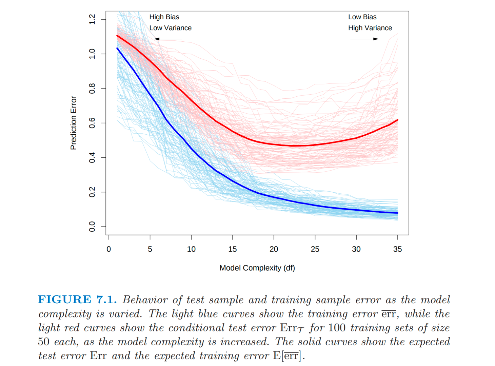

\newcommand\Tau{\mathrm{T}}

```{r setup, include=FALSE}
knitr::opts_chunk$set(echo = TRUE)

help_console <- function(topic, package,
                         format=c("text", "html", "latex", "Rd"),
                         before=NULL, after=NULL) {
  # topic - the command for which help is required
  # package - the package name with the required topic
  # format - output format
  # before - place code before the output e.g. "<blockquote>"
  # after - place code after the output e.g. "</blockquote>"

  # based on code by Noam Ross
  #  http://www.noamross.net/archives/2013-06-18-helpconsoleexample/
  # Stéphane Laurent
  #  https://stackoverflow.com/questions/60468080/
  #   print-an-r-help-file-vignette-as-output-into-an-r-html-notebook
  # and Michael Sumner (mdsumner)
  #  https://stackoverflow.com/questions/7495685/
  #   how-to-access-the-help-documentation-rd-source-files-in-r

  format <- match.arg(format)
  if (!is.character(topic)) topic <- deparse(substitute(topic))
  db <- tools::Rd_db(package)
  helpfile <- db[paste0(topic, ".Rd")][[1]]

  hs <- capture.output(
    switch(
      format,
      text = tools::Rd2txt(helpfile),
      html = tools::Rd2HTML(
        helpfile,
        package = "",
        stages = c("install", "render")
      ),
      latex = tools::Rd2latex(helpfile),
      Rd = tools:::prepare_Rd(helpfile)
    )
  )
  if (format == "html") {
    i <- grep("<body>", hs)
    j <- grep("</body>", hs)
    hs <- hs[(i+1):(j-1)]
  }
  hs <- c(before, hs, after)
  hs <- cat(hs, sep = "\n")
  invisible(hs)
}

```

# Introduction

In the last post,  we examined decision tree as an algorithmic model to understand the behavior of data. As we saw, the optimal tree is one where we grew a large tree, and pruned it to avoid an "overfitting problem" as measured by the *cost complexity criterion*. But what is the over-fitting problem with algorithmic models, and why did the cost complexity criterion allow us to manage it?


Trees are formed via an algorithm - **CART** - which is a predictive structure for predicting an outcome variable $Y$ from explanatory variables $X$. The particular tree that was formed depended on two key inputs

1. The training sample $D = \{(y_1, x_1),\dots, (y_n, x_n)\}$

2. The tuning parameters (also called *hyperparameters*) $\eta$ which governs the behavior of the algorithm. 

The predictive structure is connected to the conditional distribution of the outcome variable $Y$ given the explanatory variables $X$, e.g., a feature $F_{Y\mid X}(y \mid X = x)$. 


Given the training sample $D$ and hyperparameters, the CART algorithm generates a *fitted predictor* $\hat{m}$. Although we do not have that much choice over the training sample $D$ (although as we will see below, we have some choice), we do have more discretion over the tuning parameters. Thus a very practical problem we face in algorithmic model is that we must se tthe value of $\eta$, e.g., $\hat{\eta}$. This process is called (rather simply) **tuning**. A more elaborate description would be *hyperparameter optimization*

In this post we examine the more general principles around tuning with an eye towards its practical implementation in the case of the CART algorithm. 

# The tuning problem

What are the tuning parameters in CART? Lets take a look a look at the help file?


```{r, echo = FALSE, results = "asis"}
help_console("rpart", "rpart", format = "html")
```

The help file reveals several places where the algorithm can be tuned. Among them is a reference to an argument `control`, which is a list of options that control the detail of the algorithm. We can examine the parameters of the list:

```{r echo = FALSE, results = "asis"}
help_console("rpart.control", "rpart", format = "html")
```

We can see a few tuning parameters that stand out - `minsplit`, `minbucket`, `cp`, and `xval`, which are initiatlized to specific values. The user has control of the algorithm by setting these values. 


# Prediction Error

The tuning parameters in general should be set to maximize the performance of the model. But what is performance?

Suppose we make a prediction $\hat{Y}$ and the realized outcome is $Y$, where in general we should not expect perfect prediction and hence $\hat{Y} \neq Y$. There is a loss $L(Y,\hat{Y})$ incurred from missing the target. Common loss functions are

$$
L(\hat{Y}, Y) = 
\begin{cases}
(Y-\hat{Y})^2 \mbox{ for regression}\\
\mathbf{1}(Y \neq \hat{Y}) \mbox{ for classification}
\end{cases}
$$

Given the loss function, what is the predictive performance of the predictor $\hat{m}$. 

If the goal is to use the predictor to predict in the population that has yet to be observed, then the natural performance criterion is the average loss in the population

$$
Err_{D} = E_{Y^{0}, X^{0}} \left[L(Y^{0}, \hat{m}(X^{0})) \mid D \right]
$$
where the expectation is taken with respect to the randomness in $(Y^{0}, X^{0}) \sim F_{Y,X}$. This is the *test error* or *generalization error*, e.g., the average error we would expect in an independent test sample. Notice that the training sample $D$ is conditioned out in the assesment of performance under $Err_{D}$

Although $Err_{D}$ is the ideal performance measure, it is challenging to analyze or forecast. However if we could measure it, then this provides a path to tuning. Notice that $Err_{D} = Err_{D}(\eta)$, and hence optimal tuning would amount to

$$
\hat{\eta} = \arg \max_{\eta} Err_{D}(\eta)
$$
Thus $Err_{D}(\eta)$ would serve two distinct purposes (ESL p 222)

1. <font color = "blue"> Model tuning </font>: estimating the performance of different algorithmic models indexed by $\eta$ in order to choose the best one.

2. <font color = "blue"> Model assessment </font>: having chosen a final model, estimating its prediction error (generalization error) on new data.


In an ideal circumstance to carry out these calculations we would have a sample of data broken into three parts.

1. Training Set
2. Validation Set
3. Test Set

```{r, echo = FALSE}

```

The training set would be used to fit the data $\hat{f}(\eta)$. The validation set could be used to tune the algorithm's $\eta$ based on average loss in the validation set. And then the test set would provide a clean assesment of the test error of the tuned model at $\hat{eta}.

We typically will not have enough data for this rather clean experiment without seriously compromising the size of the training sample (which detracts from the algorithm's performance). 

Instead we will need to live in a *second best* world and consider a slightly augmented measure of performance, the *average test error*, where we also account for randomness in the training sample itself

$$
Err(\eta) = E_D\left[Err_{D}\right(\eta)]
$$
If we imagine ordering $\eta$ such that lower values of $eta$ generate simpler fitted models, and higher values of $\eta$ generate more complex fitted models, then the behavior of $Err(\eta)$ creates the canonical picture of *Bias Variance Tradeoff* (ESL p. 220)

```{r, echo = FALSE}

```

## Optimism

- Let the training sample be $ D = \{(y_i,x_i)\}_{i=1}^{n}$

- Consider a fitted model  $\hat{y}_{i}=\hat{m}\left(x_{i}\right)$, which can come from any algorithmic model $m$, and implicitly depends on the tuning parameter $\eta$.

- For simplicity consider a regression problem with squared error loss (the analysis below generalizes to many loss functions)

- The in-sample training error is 
$$
\overline{err}=\frac{1}{n}\sum\left(y_{i}-\hat{y}_{i}\right)^{2}
$$

- We have a general understanding that the $\overline{err}$ is an optimistic assessment of the object of interest, namely the test error $Err_{D}$. Can we formalize the relationship to gauge just how optimistic?

- One source of the discrepancy is that the test experiment is evaluated at potentially different points of the explanatory variables as compared to the training simple. To eliminate this additional variability, it is useful to consider the *in-sample* test error
$$
Err_{\mbox{in}} = \frac{1}{n} \sum E_{Y^{0}}\left[L(Y_{i}^{0}, \hat{m}(x_{i}) \mid D \right]
$$

- Optimism can be defined as

$$
\mbox{opp} \equiv Err_{\mbox{in}} - \overline{err}
$$

It turns out there is a natural characterization of the expected optimism, or
$$
\omega = E_{\mathbf{y}}[\mbox{opp}]
$$
Where the expectation is taken with respect to the training points $\mathbf{y} = (y_i)_{i=1}^{n}$

<div class="theorem" text='CLT'>
  \(\omega = \frac{2}{n}\sum_{i}\mbox{Cov}(y_{i}, \hat{y}_i) \)
</div>

<br>

The interpretation, to quote ESL

> Thus the amount by which $\overline{err}$ underestimates the true error depends on how strongly $y_{i}$ affects its own prediction. The harder we fit the data, the greater $Cov(\hat{y}_i, y_i)$ will be, thereby increasing the optimism.

- The proof of this result is remarkably straightforward.

- For ease of notation, let the new test data generated from the same points for the explanatory variables as the training set be denoted simply as $y_{i}^{\prime} = Y_{i}^{0}$

- The prediction error is then
\[
\frac{1}{n}\sum\left(y_{i}^{\prime}-\hat{y}_{i}\right)^{2}
\]

- Observe that the $\hat{y}_{i}'s$ are functions of all the $y_{i}'s$
and so are dependent random variables.

- However $y_{i}^{\prime}$ is independent of $\hat{y}_{i}$. 

- Recall the formula 

$$V\left(Z\right)=E\left[Z^{2}\right]-E\left[Z\right]^{2}\implies E\left[Z^{2}\right]=V\left[Z\right]+E\left[Z\right]^{2}$$

- Then
\begin{align*}
E\left[\left(y_{i}-\hat{y}_{i}\right)^{2}\right] & =V\left[y_{i}-\hat{y}_{i}\right]+E\left[y_{i}-\hat{y}_{i}\right]^{2}\\
 & =V\left[y_{i}\right]+V\left[\hat{y}_{i}\right]-2Cov\left[y_{i},\hat{y}_{i}\right]+\left(E\left[y_{i}\right]-E\left[\hat{y}_{i}\right]\right)^{2}
\end{align*}

- Observe on the other hand that using the fact $E\left[y_{i}\right]=E\left[y_{i}^{\prime}\right]$
and $V\left[y_{i}^{\prime}\right]=V\left[y_{i}\right]$

\begin{align*}
E\left[\left(y_{i}^{\prime}-\hat{y}_{i}\right)^{2}\right] & =V\left[y_{i}^{\prime}\right]+V\left[\hat{y}_{i}\right]-2Cov\left[y_{i}^{\prime},\hat{y}_{i}\right]+\left(E\left[y_{i}^{\prime}\right]-E\left[\hat{y}_{i}\right]\right)^{2}\\
 & =V\left[y_{i}\right]+V\left[\hat{y}_{i}\right]+\left(E\left[y_{i}\right]-E\left[\hat{y}_{i}\right]\right)^{2}
\end{align*}

- Hence we have the relationship that
\[
E\left[\left(y_{i}^{\prime}-\hat{y}_{i}\right)^{2}\right]=E\left[\left(y_{i}-\hat{y}_{i}\right)^{2}\right]+2Cov\left[y_{i},\hat{y}_{i}\right].
\]

- Averaging over data points
\[
E\left[\frac{1}{n}\sum_{i=1}^{n}\left(y_{i}^{\prime}-\hat{y}_{i}\right)^{2}\right]=E\left[\frac{1}{n}\sum_{i=1}^{n}\left(y_{i}-\hat{y}_{i}\right)^{2}\right]+\frac{2}{n}\sum_{i}Cov\left(y_{i},\hat{y}_{i}\right).
\]

- We can frame the result in a slightly different way for the specialized case where the true DGP is 

$$
y_{i} = m(x_i)+\epsilon_i
$$
For a homoskedastic $\epsilon_i$ with variance $\sigma^2$.

- Let us define the degrees of freedom $df\left(\hat{y}\right)$ of
the fitted model $\hat{y}$ as
\[
df\left(\hat{y}\right)=\frac{1}{\sigma^{2}}\sum Cov\left(y_{i},\hat{y}_{i}\right),
\]

- Then the relationship becomes
\[
E\left[\left(y_{i}^{\prime}-\hat{y}_{i}\right)^{2}\right]=E\left[\left(y_{i}-\hat{y}_{i}\right)^{2}\right]+\frac{2\sigma^{2}}{n}df\left(\hat{y}\right)
\]
which is words says that the expected test error is exactly the expected
training error plus a constant factor $\left(\frac{2\sigma^{2}}{n}\right)$
times the degree of freedom.

- This gives us an approach to model selection. Suppose we have a family
of fitted values $\hat{y}_{\eta}$ which depends on a tuning parameter.

- Then we can estimate 
\[
Err_{\mbox{in}}(\eta) =\frac{1}{n}\sum_{i=1}^{n}\left(y_{i}-\left(\hat{y}_{\eta}\right)_{i}\right)^{2}+\frac{2\sigma^{2}}{n}df\left(\hat{y}_{\eta}\right)
\]
replacing $\sigma^{2}$ and $df$ with estimates if needed. 
\item Then we can select
\[
\hat{\eta}=\arg\min_{\eta\in\Theta}\frac{1}{n}\left(y_{i}-\left(\hat{y}_{\eta}\right)_{i}\right)^{2}+\frac{2\sigma^{2}}{n}df\left(\hat{y}_{\eta}\right)
\]

- Observe that for a linear regression model this becomes
\begin{align*}
df\left(\hat{y}^{linreg}\right) & =\\
\frac{1}{\sigma^{2}}Tr\left(Cov\left(X\left(X^{\prime}X\right)^{-1}X^{\prime}Y\right),Y\right) & =\\
\frac{1}{\sigma^{2}}Tr\left(X\left(X^{\prime}X\right)^{-1}X^{\prime}V\left[Y\right]\right) & =\\
Tr\left(X\left(X^{\prime}X\right)^{-1}X^{\prime}\right) & =\\
Tr\left(X^{\prime}X\left(X^{\prime}X\right)^{-1}\right) & =p
\end{align*}

- The optimism term $\frac{2}{n}\sigma^{2}\left(p\right)$ depends on
3 key factors

    1. Grows with $\sigma^{2}$: more noise gives the model more opportunities
to seem to fit well by capitalizing on chance. 

    2. Shrinks with $n$: more data at any noise level makes it harder to
pretend the fit is better than it is in reality. 

    3. Grows with $p$: every extra parameter is another control which can
adjust to fit the noise. 

- Hence model selection on the number of predictors becomes
\[
\hat{k}=\arg\min_{k\in\left\{ 1,\dots,p\right\} }\frac{1}{n}\sum\left(y_{i}-\left(\hat{y}_{k}\right)_{i}\right)^{2}+\frac{2\sigma^{2}}{n}k
\]
which gives Mallow's $C_{p}$ criterion for choice among linear models.

## Cross-Validation


- An alternative approach to estimating the expected test error $Err$ associated with an ML
technique $\hat{m}$ is cross validation. 

- Let the fitted value under a given ML technique class be $\hat{y}_{\eta}$
for model tuning parameter $\eta\in\Theta$

- Generally $\eta$ is ordered such that
larger or smaller values are associated with a higher degree of regularization
in the method. We wish to select the value $\eta^{\ast}$ that minimizes $Err$.

- Cross validation is a resampling technique that allows us to statistically approximate $Err$

- Split the training set randomly into $K$ divisions or *folds* for some number $K$. Express the folds as $F_{1},\dots,F_{K}$ where
$$F_{1}\cup \dots \cup F_{K}= \{ 1,\dots,n\} $$ with $n_{k}=\left|F_{k}\right|$
points in fold $k$.

- For each $k=1,\dots,K$, we fit our model to all points besides the
$k^{th}$ fold, and let the $i^{th}$ fitted values be denotes $\hat{m}_{\eta}^{-k}\left(x_{i}\right)$. 

- We then evaluate the error on the points in the $k^{th}$ fold
\[
CV_{k}\left(\eta\right)=\frac{1}{n_{k}}\sum_{i\in F_{k}}\left(y_{i}-\hat{m}_{\eta}^{-k}\left(x_{i}\right)\right)^{2}
\]

- We then average over the folds to estimate prediction error
\[
CV\left(\eta\right)=\frac{1}{K}CV_{k}\left(\eta\right)
\]

- The process can be depicted as

```{r, echo = FALSE}
knitr::include_graphics("images/cv.png")
```

- This is $K$-fold cross validation, and the tuning procedure becomes
\[
\hat{\eta}=\arg\min_{\eta\in\left\{ \eta_{1},\dots,\eta_{m}\right\} }CV\left(\eta\right)
\]

- This leaves open the choice of $K$.

- For $K=2$ we have split sample cross-validation. The problem is that
the CV error estimate will be biased upwards.

- For $K=n$ we have leave-one-out cross validation. The problem is
that the CV error estimate will have high variance. 

- A standard to balance this bias-variance tradeoff is setting $K=5$
or $K=10$, where each iteration we train on a fraction of about $\frac{K-1}{K}$
of the total training set so we reduce bias, and there is less overlap
among training set, thus reducing bias.

- Recognizing there is some variance in the CV error estimate, the one
standard error rule is an alternative to choice of $\eta$. Let
\[
SD\left(\eta\right)=\sqrt{var\left(CV_{1}\left(\eta\right),\dots,CV_{K}\left(\eta\right)\right)}
\]
and 
\[
SE\left(\eta\right)=\frac{SD\left(\eta\right)}{\sqrt{K}}
\]
is standard error estimate of $CV\left(\eta\right).$

- The one standard error rule is to move $\eta$ in the direction
of increasing regularization until it ceases to be true that
\[
CV\left(\eta\right)\leq CV\left(\hat{\eta}\right)+SE\left(\hat{\eta}\right)
\]
e.g., we take the most simplest model whose error is within one
standard error of the minimal error. 

- See the interesting discussion on the proper application of CV at the top of page 245.

- Let us now revisit the Ames, Iowa data to see if multidimensional tuning would play a role. 

```{r, echo = TRUE}
library(rsample)     # data splitting 
library(dplyr)       # data wrangling
library(rpart)       # performing regression trees
library(rpart.plot)  # plotting regression trees
```


Create training and test samples.

```{r, echo = TRUE}
# Create training (70%) and test (30%) sets for the AmesHousing::make_ames() data.
# Use set.seed for reproducibility

set.seed(123)
ames_split <- initial_split(AmesHousing::make_ames(), prop = .7)
ames_train <- training(ames_split)
ames_test  <- testing(ames_split)
```

Setup a grid for the tuning parameters

```{r, echo = TRUE}
hyper_grid <- expand.grid(
  minsplit = seq(5, 20, 1),
  maxdepth = seq(8, 15, 1)
)

head(hyper_grid)
```

Use CART for each tuning parameter value in the grid. 

```{r, echo = TRUE}
models <- list()

for (i in 1:nrow(hyper_grid)) {
  
  # get minsplit, maxdepth values at row i
  minsplit <- hyper_grid$minsplit[i]
  maxdepth <- hyper_grid$maxdepth[i]

  # train a model and store in the list
  models[[i]] <- rpart(
    formula = Sale_Price ~ .,
    data    = ames_train,
    method  = "anova",
    control = list(minsplit = minsplit, maxdepth = maxdepth)
    )
}
```
```{r}
# function to get optimal cp
get_cp <- function(x) {
  min    <- which.min(x$cptable[, "xerror"])
  cp <- x$cptable[min, "CP"] 
}

# function to get minimum error
get_min_error <- function(x) {
  min    <- which.min(x$cptable[, "xerror"])
  xerror <- x$cptable[min, "xerror"] 
}

hyper_grid %>%
  mutate(
    cp    = purrr::map_dbl(models, get_cp),
    error = purrr::map_dbl(models, get_min_error)
    ) %>%
  arrange(error) %>%
  top_n(-5, wt = error)
```

Extract the tree for the optimal value of the tuning parameters. 

```{r, echo = TRUE}
optimal_tree <- rpart(
    formula = Sale_Price ~ .,
    data    = ames_train,
    method  = "anova",
    control = list(minsplit = 17, maxdepth = 12, cp = 0.01)
    )
```

The new test error

```{r, echo = TRUE}
pred <- predict(optimal_tree, newdata = ames_test)
p_error <- Metrics::rmse(actual = ames_test$Sale_Price, predicted = pred)
p_error
```